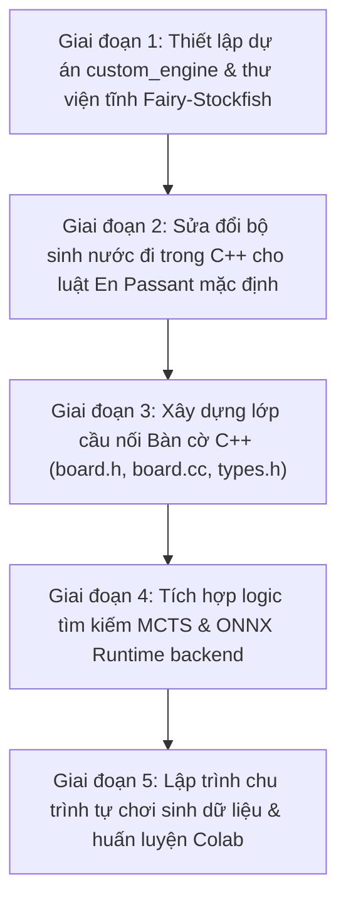
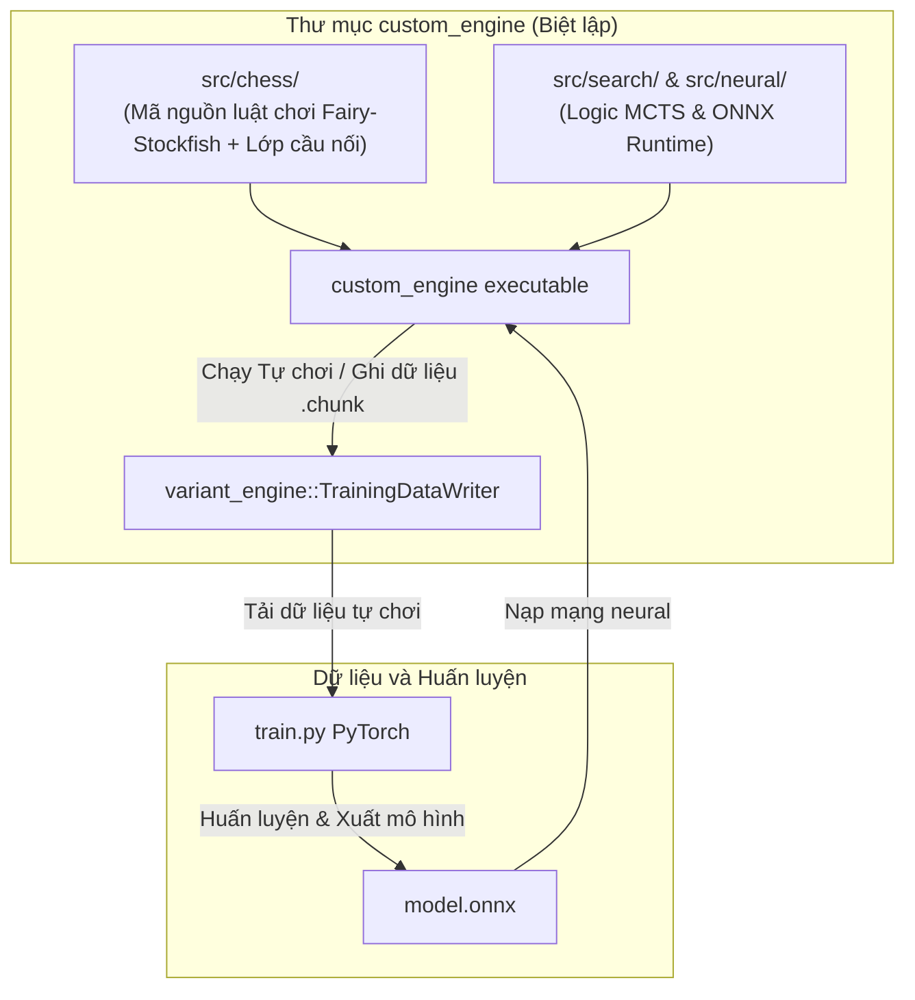

# Kế hoạch Triển khai Toàn diện từ A đến Z - Engine Cờ Biến thể 10x10 Tùy chỉnh (Kiến trúc C++ lai tối ưu hiệu năng)

Bản kế hoạch này được thiết kế để làm tài liệu hướng dẫn duy nhất và đầy đủ nhất cho toàn bộ quá trình phát triển dự án. Tất cả các thành phần kiến trúc, cách tổ chức thư mục, cấu trúc dữ liệu nước đi, cơ chế tích hợp MCTS, cách giao tiếp với mạng neural (bao gồm việc giải mã cấu trúc đầu ra tùy chỉnh của bạn), và quy trình huấn luyện học tăng cường từ mạng 0 ELO được chi tiết hóa dưới đây theo trật tự thực hiện thực tế kể từ thời điểm hiện tại.

---

## 1. Lộ trình Triển khai Từng bước từ Thời điểm Hiện tại (Step-by-Step Roadmap)

Dưới đây là quy trình thực hiện dự án theo trật tự thời gian và phụ thuộc kỹ thuật, tính từ trạng thái hiện tại (kho lưu trữ Git đã được thiết lập cục bộ và trên GitHub):



### Giai đoạn 1: Thiết lập Dự án C++ `custom_engine` và Cấu hình Biên dịch Hợp nhất (Unified Compilation)
*   **Mục tiêu**: Tạo cấu trúc thư mục biệt lập cho engine, thiết lập hệ thống build Meson/Ninja, sao chép các mã nguồn luật chơi cần thiết từ Fairy-Stockfish vào dự án và chuẩn bị biên dịch trực tiếp toàn bộ các tệp tin trong cùng một đơn vị build.
*   **Các bước thực hiện**:
    1.  Tạo thư mục `d:\chess_variant\custom_engine`.
    2.  Tạo các thư mục con: `src/chess`, `src/search`, `src/neural`, `src/selfplay`, `src/trainingdata` (không cần thư mục `third_party` bên ngoài để giữ dự án hoàn toàn độc lập và tinh gọn).
    3.  Sao chép toàn bộ mã nguồn cần thiết (từ `d:\chess_variant\Fairy-Stockfish\Fairy-Stockfish-master\src\`) trực tiếp vào thư mục dự án `custom_engine\src\chess\`.
    4.  Viết file `custom_engine/meson.build` định nghĩa cấu hình build C++ hợp nhất (sử dụng tiêu chuẩn C++17 trở lên). Cấu hình này sẽ khai báo danh sách tất cả các tệp `.cpp` trực tiếp trong thư mục `src/chess/` và các thư mục `src/` khác để trình biên dịch xây dựng trực tiếp thành file executable duy nhất.
    5.  Bật các macro preprocessor quan trọng trong `meson.build` gồm `-DLARGEBOARDS` và `-DALLVARS` để áp dụng đồng loạt cho toàn bộ các file được biên dịch, đảm bảo hỗ trợ bàn cờ 10x10.
    6.  Chạy thử lệnh `meson setup build` để tạo môi trường build và đảm bảo các file cấu hình liên kết thư viện ngoài (như ONNX Runtime) được tìm thấy, chuẩn bị cho quá trình biên dịch sau khi sửa code.

### Giai đoạn 2: Sửa đổi Bộ sinh nước đi trong C++ cho Luật En Passant Mặc định
*   **Mục tiêu**: Chỉnh sửa trực tiếp file `movegen.cpp` của Fairy-Stockfish để đảm bảo bất kỳ quân tốt tùy chỉnh nào khi di chuyển vào ô en passant trống đều kích hoạt nước đi ăn en passant thay vì đi thường.
*   **Các bước thực hiện**:
    1.  Mở tệp [movegen.cpp](file:///d:/chess_variant/custom_engine/src/chess/movegen.cpp) (chúng ta sửa trực tiếp tệp đã sao chép nằm trong thư mục dự án### Giai đoạn 3: Xây dựng Lớp Cầu nối Bàn cờ C++ (Bridge Board Class)
*   **Mục tiêu**: Thay thế trự    > **Thay đổi Thiết kế Tối giản**:
    > Thay vì tạo ra namespace mới `variant_engine` dẫn đến việc phải sửa hàng ngàn dòng mã tìm kiếm MCTS của Lc0, chúng ta sẽ **giữ nguyên namespace `lczero`** và viết tệp tin `types.h` và `board.h` bọc trong thư mục riêng `src/lczero_chess/chess/`.
    >
    > Bằng cách bọc trực tiếp kiểu `Stockfish::Move` và `Stockfish::Position` dưới tên lớp `lczero::Move` và `lczero::ChessBoard`, thuật toán MCTS của Lc0 sẽ biên dịch thành công mà **không cần sửa đổi bất kỳ dòng mã tìm kiếm nào**.
    >
    > **Tránh xung đột tên file (Header Collision)**:
    > Do cả Stockfish và Lc0 đều sử dụng các tệp tin cùng tên như `types.h`, `position.h`, để tránh việc trình biên dịch nạp sai tệp tin (hoặc tự include đệ quy vô hạn), chúng ta sẽ tổ chức thư mục cầu nối riêng tại `src/lczero_chess/chess/`. 
    > Trong các tệp cầu nối này, ta nạp tệp gốc của Stockfish bằng đường dẫn tương đối rõ ràng (ví dụ: `#include "../../chess/types.h"`).

#### 1. Định nghĩa kiểu dữ liệu trong [types.h](file:///d:/chess_variant/custom_engine/src/lczero_chess/chess/types.h)
Chúng ta sẽ định nghĩa tệp `types.h` trong namespace `lczero` để định nghĩa lại `Move` và `Square` theo cơ chế của Fairy-Stockfish:
```cpp
#pragma once
#include <cstdint>
#include <string>
#include <vector>
#include "../../chess/types.h" // Nạp kiểu gốc của Stockfish qua đường dẫn tương đối để tránh tự include đệ quy

namespace lczero {

// Sử dụng trực tiếp kiểu Move của Stockfish (đã tự động cấu hình 32-bit khi bật LARGEBOARDS)
using Move = Stockfish::Move;
using Square = Stockfish::Square;

constexpr Move MOVE_NONE = Stockfish::MOVE_NONE;
constexpr Move MOVE_NULL = Stockfish::MOVE_NULL;

using MoveList = std::vector<Move>;

} // namespace lczero
```
#### 2. Khai báo Lớp `lczero::ChessBoard` trong [board.h](file:///d:/chess_variant/custom_engine/src/lczero_chess/chess/board.h)
Chúng ta thiết kế lớp `lczero::ChessBoard` tương thích với interface mà MCTS của Lc0 yêu cầu:
```cpp
#pragma once
#include <string>
#include <vector>
#include <deque>
#include "types.h" // Nạp types.h bọc của lczero cùng thư mục
#include "../../chess/position.h" // Nạp position.h gốc của Stockfish qua đường dẫn tương đối để tránh xung đột

namespace lczero {

class ChessBoard {
public:
    ChessBoard() = default;
    ChessBoard(const ChessBoard& other);
    ChessBoard(const std::string& fen) { SetFromFen(fen); }
    ChessBoard& operator=(const ChessBoard& other);

    // Điểm khởi đầu FEN của biến thể 10x10 của bạn
    static const char* kStartposFen;

    // Thiết lập thế cờ từ FEN
    void SetFromFen(std::string_view fen, int* rule50_ply = nullptr, int* moves = nullptr);
    
    // Làm trống bàn cờ
    void Clear();

    // Sinh nước đi hợp lệ (thay thế cho GeneratePseudolegalMoves và GenerateLegalMoves của Lc0)
    MoveList GenerateLegalMoves() const;

    // Áp dụng nước đi (Trả về true nếu nước đi làm reset luật 50 nước đi)
    bool ApplyMove(Move move);

    // Hủy nước đi (nếu cần thiết cho việc duyệt thử)
    void UndoMove();

    // Kiểm tra Vua của mình có đang bị chiếu hay không
    bool IsUnderCheck() const;

    // Tiện ích định dạng nước đi thành chuỗi UCI (ví dụ: "a3c5")
    std::string MoveToString(Move move) const;
    Move ParseMove(std::string_view move_str) const;

    // Trả về đối tượng Position của Fairy-Stockfish bên dưới
    const Stockfish::Position& GetRawPosition() const { return pos; }

private:
    Stockfish::Position pos;
    std::deque<Stockfish::StateInfo> states; // Deque đảm bảo an toàn bộ nhớ (pointer stability)
    const Stockfish::Variant* variant_def = nullptr;
};

} // namespace lczero
```

#### 3. Triển khai Lớp `lczero::ChessBoard` trong [board.cc](file:///d:/chess_variant/custom_engine/src/lczero_chess/chess/board.cc)
*   **Hàm khởi tạo copy (`ChessBoard(const ChessBoard& other)`)**: 
    Do `Stockfish::Position` chứa con trỏ `st` trỏ tới trạng thái `StateInfo` hiện tại, khi copy đối tượng `ChessBoard`, chúng ta phải copy cả deque `states` và gán lại con trỏ `pos.set_state(&states.back())` để đảm bảo con trỏ không trỏ sang vùng nhớ của đối tượng cũ.
*   **Hàm `SetFromFen`**:
    1. Đảm bảo biến thể `"custom_10x10_variant"` được tải thông qua `variants.find()`.
    2. Reset `states` về kích thước 1 phần tử.
    3. Gọi `pos.set()` của Stockfish để đồng bộ hóa bàn cờ từ FEN.
    4. Trả về `rule50_ply` và `moves` tương ứng.
*   **Hàm `GenerateLegalMoves`**:
    1. Gọi `MoveList<LEGAL> moveList(pos)`.
    2. Copy toàn bộ nước đi hợp lệ vào `lczero::MoveList` để trả về cho MCTS.
*   **Hàm `ApplyMove`**:
    1. Thêm một `StateInfo` mới vào deque: `states.emplace_back()`.
    2. Gọi `pos.do_move(move, states.back())`.
    3. Trả về `true` nếu nước đi là ăn quân hoặc đi tốt (reset luật 50 nước đi).

#### 4. Quy trình Kiểm thử Lớp Cầu nối (`--test-board`)
*   Chúng ta sẽ thêm cờ `--test-board` vào [main.cc](file:///d:/chess_variant/custom_engine/src/main.cc).
*   Chương trình kiểm thử sẽ:
    1. Khởi tạo `lczero::ChessBoard` từ FEN khởi đầu.
    2. In ra các nước đi hợp lệ dưới dạng chuỗi (ví dụ: `a3c5`).
    3. Áp dụng nước đi và kiểm tra tính đúng đắn của trạng thái bàn cờ sau mỗi nước đi.
đặc trưng đầu vào):
        *   **Mặt phẳng 0 - 12 (13 planes)**: Vị trí của các quân Trắng theo thứ tự: Pawn `P`, Sergeant `S`, Knight `N`, Bishop `B`, Rook `R`, Queen `Q`, King `K` (Royal), Amazon `A`, Chancellor `E`, Archbishop `H`, General `M`, Wildebeest `V`, Alibaba `Y`. (Mỗi ô cờ có quân tương ứng sẽ ghi `1.0f`, còn lại ghi `0.0f`).
        *   **Mặt phẳng 13 - 25 (13 planes)**: Vị trí của các quân Đen tương tự như trên.
        *   **Mặt phẳng 26 - 29 (4 planes)**: Quyền nhập thành (Castling rights): Cánh Vua Trắng, Cánh Hậu Trắng, Cánh Vua Đen, Cánh Hậu Đen. (Ghi `1.0f` cho toàn bộ mặt phẳng nếu có quyền, ngược lại ghi `0.0f`).
        *   **Mặt phẳng 30 (1 plane)**: Lượt đi hiện tại. (Ghi `1.0f` nếu Trắng đi, `0.0f` nếu Đen đi).
        *   **Mặt phẳng 31 (1 plane)**: Số lượt đếm quy tắc 50 nước đi (tỉ lệ hóa `rule50 / 100.0f`).
        *   **Mặt phẳng 32 - 33 (2 planes)**: Số lần bị chiếu còn lại của Trắng và Đen (tỉ lệ hóa `checksRemaining / 7.0f`).
        *   *Lưu ý*: Áp dụng quy tắc chuẩn hóa Side-to-Move. Nếu bên tới lượt đi là Đen, chúng ta sẽ lật dọc bàn cờ (hàng 10 đổi hàng 1) và hoán đổi vị trí các mặt phẳng của Trắng/Đen để mạng neural luôn nhìn nhận thế trận dưới góc nhìn của người chuẩn bị đi.

#### 3. Quy trình Kiểm thử và Xác nhận Lớp Cầu nối
*   Thêm cờ `--test-board` vào [main.cc](file:///d:/chess_variant/custom_engine/src/main.cc).
*   Bộ kiểm thử `--test-board` sẽ thực hiện:
    1. Thiết lập bàn cờ từ FEN khởi đầu 10x10 đầy đủ.
    2. Xác nhận danh sách nước đi hợp lệ khớp chính xác với 34 nước đi đầu tiên.
    3. Đi thử các nước đi phức tạp như Nhập thành (`f1d1` hoặc `f1h1`), Phong cấp Sergeant, và ăn tốt en passant.
    4. Xác nhận trạng thái trò chơi kết thúc (stalemate xử thua và 7-checks xử thua).
    5. In ra kết cấu tensor mã hóa bàn cờ từ `EncodeBoard()` để đảm bảo dữ liệu nhị phân hoàn toàn chuẩn xác.


### Giai đoạn 4: Tích hợp Tìm kiếm MCTS và ONNX Runtime
*   **Mục tiêu**: Sao chép thuật toán tìm kiếm MCTS đa luồng hiệu năng cao của Lc0, tích hợp ONNX Runtime backend để nạp mô hình `.onnx` và thực hiện suy luận.
*   **Các bước thực hiện**:
    1.  Sao chép các file tìm kiếm trong thư mục `src/search/` của Lc0 sang `custom_engine/src/search/` và **giữ nguyên namespace `lczero`** (để tránh sửa mã nguồn MCTS của Leela).
    2.  Tích hợp các tệp mã nguồn điều phối luồng neural từ `src/neural/` của Lc0.
    3.  Tích hợp thư viện ONNX Runtime C++ API trong `custom_engine/src/neural/backends/onnx/`.
    4.  Lập trình hàm giải mã mạng neural `MapMoveToNetworkIndex(lczero::Move move)`: Ánh xạ nước đi 32-bit thành chỉ số index tĩnh trong tensor Policy logits của bạn.
    5.  Xây dựng logic gom cụm (Batching) các yêu cầu đánh giá từ nhiều luồng tìm kiếm MCTS thành một lô để đưa vào ONNX Runtime, tối ưu hóa hiệu năng tính toán.

### Giai đoạn 5: Lập trình Chu trình Tự chơi và Huấn luyện Học tăng cường (RL)
*   **Mục tiêu**: Viết mã nguồn ghi dữ liệu huấn luyện, thực thi chế độ tự chơi C++ sinh tệp `.chunk`, và thiết lập tập lệnh Python/PyTorch huấn luyện mạng trên Google Colab.
*   **Các bước thực hiện**:
    1.  Xây dựng lớp `lczero::trainingdata::TrainingDataWriter` để ghi lại lịch sử ván đấu (các thế cờ và phân phối lượt đi $\pi$ từ MCTS) ra tệp nhị phân `.chunk`.
    2.  Viết chương trình điều phối tự chơi `custom_engine selfplay` chạy đa luồng để tự đánh và lưu trữ dữ liệu.
    3.  Viết script Python `init_model.py` để khởi tạo một file `model.onnx` chứa các trọng số ngẫu nhiên (mô hình 0 ELO) nhằm khởi động chu kỳ tự chơi đầu tiên.
    4.  Viết mã nguồn huấn luyện PyTorch `train.py` để chạy trên Google Colab: đọc các tệp `.chunk`, huấn luyện mô hình để dự đoán Policy và Value, sau đó xuất ra tệp `model.onnx` thế hệ tiếp theo.
    5.  Thiết lập quy trình tự động hóa: sinh game $\rightarrow$ huấn luyện $\rightarrow$ cập nhật mô hình $\rightarrow$ tiếp tục sinh game để tăng sức mạnh của mô hình một cách liên tục.

---

## 2. Cấu hình Luật chơi và Quân cờ biến thể 10x10 của Bạn

Để tích hợp luật chơi biến thể 10x10 này vào Fairy-Stockfish, chúng ta sẽ định nghĩa một biến thể cờ mới trong tập tin cấu hình `variants.ini`. Dưới đây là mô tả chi tiết cách cấu hình luật chơi và cách biểu diễn Betza cho các quân cờ theo đúng mô tả của bạn:

### 2.1. Phân định thắng thua (Game End Conditions)
- **Chiếu hết (Checkmate)**: Luật mặc định thắng cuộc.
- **Luật 7-checks (Check Limit)**: Được kích hoạt thông qua cấu hình `checkCounting = true`. Số lượt chiếu giới hạn sẽ được truyền trực tiếp qua phần phụ của chuỗi FEN khởi đầu (ví dụ: `7+7` để biểu diễn White và Black đều bắt đầu với giới hạn 7 lần bị chiếu). Khi một bên bị chiếu đủ 7 lần, bên chiếu sẽ chiến thắng.
- **Stalemate xử thua (Stalemate as Loss)**: Được thiết lập thông qua `stalemateValue = loss`. Bên nào bị stalemate sẽ trực tiếp bị xử thua thay vì xử hòa như cờ vua truyền thống.

### 2.2. Biểu diễn các quân cờ bằng Ký hiệu Betza trong cấu hình
Chúng ta sẽ ánh xạ các quân cờ tiên của bạn như sau:
1. **Amazon (A)**: Là sự kết hợp của Hậu và Mã. Tương đương với quân Amazon mặc định của Fairy-Stockfish.
   - Ký hiệu: `'a'` hoặc `'A'`
   - Ký hiệu Betza: `QN`
2. **Chancellor (E)**: Là sự kết hợp của Xe và Mã.
   - Ký hiệu: `'e'` hoặc `'E'` (Ánh xạ từ quân `chancellor` mặc định vốn dùng chữ `c` sang chữ `e` để khớp với luật của bạn).
   - Ký hiệu Betza: `RN`
3. **Archbishop (H)**: Là sự kết hợp của Tượng và Mã.
   - Ký hiệu: `'h'` hoặc `'H'` (Ánh xạ từ quân `archbishop` mặc định vốn dùng chữ `a` sang chữ `h` để khớp với luật của bạn và tránh xung đột với Amazon).
   - Ký hiệu Betza: `BN`
4. **General (M)**: Là sự kết hợp của Vua và Mã (Centaur).
   - Ký hiệu: `'m'` hoặc `'M'`
   - Ký hiệu Betza: `KN`
5. **Wildebeest (V)**: Là sự kết hợp của Camel (nhảy 3-1) và Mã (nhảy 2-1). Chúng ta sẽ định nghĩa quân này thông qua khe cắm quân tùy chỉnh `customPiece1`.
   - Ký hiệu: `'v'` hoặc `'V'`
   - Ký hiệu Betza: `CN`
6. **Alibaba (Y)**: Là quân nhảy (leaper) nhảy như King nhưng hướng nhảy dài hơn 1 ô (tức là nhảy đúng 2 ô theo mọi hướng dọc, ngang, chéo). Tương đương với sự kết hợp giữa Alfil (nhảy chéo 2 ô) và Dabbaba (nhảy thẳng 2 ô). Định nghĩa qua `customPiece2`.
   - Ký hiệu: `'y'` hoặc `'Y'`
   - Ký hiệu Betza: `AD`
7. **Sergeant (S)**: Tốt Sergeant, định nghĩa qua `customPiece3`.
   - Ký hiệu: `'s'` hoặc `'S'`
   - Ký hiệu Betza: `fKifmnDifmnA`
     - `fK`: Đi hoặc ăn 1 ô ở 3 hướng trước mặt (thẳng trước, chéo trước trái, chéo trước phải).
     - `ifmnD`: Nhảy 2 ô thẳng phía trước từ vị trí khởi đầu, nhưng chỉ là nước đi không ăn quân (`m`), không thể nhảy qua quân khác cản đường (`n`), cự ly 2 ô (`D`).
     - `ifmnA`: Nhảy 2 ô chéo phía trước (chéo trái hoặc chéo phải) từ vị trí khởi đầu, chỉ đi không ăn quân (`m`), không thể nhảy qua quân khác cản đường (`n`), cự ly 2 ô chéo (`A`).
     - Tổng cộng, Sergeant có thể nhảy 2 ô theo cả 3 hướng phía trước nếu không bị cản ở ô trung gian và không ăn quân.
     - Cơ chế để lại ô bắt tốt qua đường (En Passant target) khi nhảy 2 ô sẽ tự động được xử lý bởi cấu hình `pawnTypes` và `enPassantTypes`.

### 2.3. Giải mã và Xây dựng FEN Khởi đầu Chuẩn xác
Dựa trên chuỗi FEN dạng lưới đệm bạn cung cấp (bỏ các ký tự đệm `x`), cấu trúc 10x10 được dịch chi tiết như sau:
- **Hàng 10 (Đen)**: `vrhabkberv` (Wildebeest, Xe, Archbishop, Tượng, Amazon, Royal General, Tượng, Chancellor, Xe, Wildebeest)
- **Hàng 9 (Đen)**: `msysnnsysm` (General, Sergeant, Alibaba, Sergeant, Mã, Mã, Sergeant, Alibaba, Sergeant, General)
- **Hàng 8 (Đen)**: `yppppppppy` (Alibaba, 8 Tốt thường, Alibaba)
- **Hàng 7, 6, 5, 4**: Trống hoàn toàn (`10` ô trống mỗi hàng)
- **Hàng 3 (Trắng)**: `YPPPPPPPPY` (Alibaba, 8 Tốt thường, Alibaba)
- **Hàng 2 (Trắng)**: `MSYSNNSYSM` (General, Sergeant, Alibaba, Sergeant, Mã, Mã, Sergeant, Alibaba, Sergeant, General)
- **Hàng 1 (Trắng)**: `VRHABKBERV` (Wildebeest, Xe, Archbishop, Tượng, Amazon, Royal General, Tượng, Chancellor, Xe, Wildebeest)

> [!NOTE]
> **Quy ước Royal Piece đặc thù**:
> Theo yêu cầu của bạn, chỉ có quân `M` (General) ở trung tâm hàng sau của mỗi bên (cột 6) là quân **Royal** (thua cuộc nếu bị chiếu hết hoặc stalemate). Các quân `M` khác chỉ là quân chiến đấu bình thường.
> Để biểu diễn điều này trong Fairy-Stockfish:
> - Quân Royal General được gán vào khe cắm `king` (`king = k:KN`), hiển thị dưới dạng ký hiệu `'k'` / `'K'`.
> - Các quân General chiến đấu bình thường được gán vào khe cắm `centaur` (`centaur = m:KN`), hiển thị dưới dạng ký hiệu `'m'` / `'M'`.
> Thiết lập này đã được chạy kiểm thử thành công bằng Python API của Fairy-Stockfish (`pyffish`), tạo ra đúng 34 nước đi hợp lệ tại nước đi đầu tiên.

Chuỗi FEN khởi đầu chính xác là:
`vrhabkberv/msysnnsysm/yppppppppy/10/10/10/10/YPPPPPPPPY/MSYSNNSYSM/VRHABKBERV w - - 7+7 0 1`

### 2.4. Luật Nhập thành (Castling) & Di chuyển của Vua/Xe
Bàn cờ có quân Royal General (`K`) khởi đầu ở cột `f` (cột 6) và 2 quân Xe nhập thành (`R`) ở cột `b` (cột 2) và cột `i` (cột 9).
Các nguyên tắc nhập thành khả thi được cấu hình như sau:
1. **Nhập thành cánh trái (Queenside)**:
   - King di chuyển ngang 2 ô sang bên trái (từ cột `f` xuống cột `d` / `d1`).
   - Xe ở cột `b` nhảy qua Vua và đứng ở ô kế bên Vua phía trong (tức là cột `e` / `e1`).
   - Cấu hình: `castlingQueensideFile = d` và `castlingRookQueensideFile = b`.
2. **Nhập thành cánh phải (Kingside)**:
   - King di chuyển ngang 2 ô sang bên phải (từ cột `f` lên cột `h` / `h1`).
   - Xe ở cột `i` nhảy qua Vua và đứng ở ô kế bên Vua phía trong (tức là cột `g` / `g1`).
   - Cấu hình: `castlingKingsideFile = h` và `castlingRookKingsideFile = i`.
3. **Các quy tắc cấm nhập thành chuẩn**:
   - Vua và Xe chưa từng di chuyển trước đó.
   - Không có bất kỳ quân cờ nào chắn giữa đường đi của Vua và Xe.
   - Vua không đang bị chiếu, và không đi qua/đáp xuống bất kỳ ô nào đang bị đe dọa bởi quân đối phương (ví dụ nếu ô `g1` bị đe dọa thì không thể nhập thành cánh phải).
   - *Lưu ý*: Ký hiệu nước đi nhập thành trong UCI chuẩn sẽ được ghi nhận dưới dạng `King_start + King_end`, tức là `f1d1` (nhập thành cánh trái) và `f1h1` (nhập thành cánh phải).

### 2.5. Luật Phong cấp giới hạn
Khi Tốt thường `P` và Tốt Sergeant `S` tiến vào hàng phong cấp (hàng 9 và 10 cho Trắng, hàng 2 và 1 cho Đen), chúng **bắt buộc phải phong cấp** và chỉ được phong cấp giới hạn trong các quân cờ sau:
- **Tượng** (Bishop) - `'b'` / `'B'`
- **Archbishop** - `'h'` / `'H'`
- **General** (Centaur) - `'m'` / `'M'`
- **Mã** (Knight) - `'n'` / `'N'`
- **Wildebeest** - `'v'` / `'V'`
- **Alibaba** - `'y'` / `'Y'`
- *Cấu hình*: `promotionPieceTypes = b h m n v y` (ngăn cản việc phong cấp thành Hậu, Xe, Amazon, Chancellor).

### 2.6. Cấu hình tệp `variants.ini` hoàn chỉnh của Biến thể
```ini
[custom_10x10_variant]
maxRank = 10
maxFile = j

# Định nghĩa các quân cờ tiêu chuẩn
pawn = p
knight = n
bishop = b
rook = r
queen = q
# King di chuyển như Centaur (KN) và mang thuộc tính Royal mặc định
king = k:KN

# Định nghĩa các quân cờ tiên của bạn
amazon = a
chancellor = e
archbishop = h
centaur = m
customPiece1 = v:CN
customPiece2 = y:AD
customPiece3 = s:fKifmnDifmnA

# Cấu hình các nhóm quân tốt
# Cả Tốt thường 'p' và Tốt Sergeant 's' đều là quân dạng pawn
pawnTypes = p s
promotionPawnTypes = p s
enPassantTypes = p s
nMoveRuleTypes = p s

# Khu vực đi 2 ô đầu tiên cho tốt (Rank <= 3 cho Trắng, Rank >= 8 cho Đen)
doubleStep = true
doubleStepRegionWhite = *1 *2 *3
doubleStepRegionBlack = *10 *9 *8

# Khu vực phong cấp bắt buộc (từ hàng 9 trở đi cho Trắng, hàng 2 trở xuống cho Đen)
promotionRegionWhite = *9 *10
promotionRegionBlack = *2 *1
mandatoryPawnPromotion = true
promotionPieceTypes = b h m n v y

# Luật Nhập thành Chess960 tùy chỉnh
castling = true
castlingKingsideFile = h
castlingQueensideFile = d
castlingRookKingsideFile = i
castlingRookQueensideFile = b

# Luật chơi kết thúc game
stalemateValue = loss
checkCounting = true
```

### 2.7. Cơ chế En Passant đặc thù của Sergeant (Kiểm thử & Xác nhận)
Chúng tôi đã kiểm thử trực tiếp tình huống bạn đưa ra:
- **Tình huống**:
  - Sergeant trắng ở `a3`, Sergeant đen ở `b5`.
  - Trắng đi `a3c5` (nước đi nhảy 2 ô chéo, đi qua `b4` và đáp xuống `c5`).
  - Đen đi `b5b4`.
- **Kết quả kiểm thử thực tế trên Fairy-Stockfish**:
  - Nước đi `b5b4` của Đen là **nước đi BÌNH THƯỜNG (Quiet Move)**, không phải nước đi ăn en passant. Quân Sergeant Trắng ở `c5` **vẫn còn nguyên vẹn trên bàn cờ**.
- **Giải thích cơ chế dưới góc độ hình học cờ vua & Engine**:
  1. Trong cờ vua, nước đi bắt tốt qua đường (en passant) phải sử dụng **khả năng ăn quân** (capture) của quân cờ.
  2. Với tốt thường, nước đi tiến thẳng là nước đi bình thường (quiet), nước đi chéo là nước đi ăn quân (capture). Do đó, tốt thường chỉ có thể bắt en passant bằng cách đi chéo sang cột khác (ví dụ từ tốt thường Đen ở `a5` đi chéo sang `b4` để ăn quân Sergeant Trắng ở `c5`).
  3. Với Sergeant `s` (Betza: `fKifmnDifmnA`), nước đi thẳng (`b5b4`) vừa là nước đi bình thường (quiet), vừa là nước đi ăn quân bình thường (capture). Tuy nhiên, dưới logic của Fairy-Stockfish, en passant chỉ được sinh ra cho các nước đi thuộc nhóm *chỉ có khả năng ăn quân* (`attacks & ~quiets`). Do đó, nước đi thẳng `b5b4` của Sergeant đen chỉ được coi là nước đi bình thường mà thôi.
  4. **Sự khác biệt quan trọng về loại quân thực hiện bắt en passant**:
     - **Nếu quân Đen ở `a5` là Tốt thường (`p`)**: Nước đi `a5b4` (đi chéo sang ô en passant `b4`) **là nước đi ăn en passant hợp lệ**, và nó sẽ loại bỏ quân Sergeant trắng ở `c5` khỏi bàn cờ (đã kiểm chứng thành công trong script `test_pawn_adjacent_ep.py`). Điều này là do nước đi chéo của Tốt thường là nước đi chỉ dùng để ăn quân (capture-only).
     - **Nếu quân Đen ở `a5` là Sergeant (`s`)**: Nước đi `a5b4` (đi chéo sang ô en passant `b4`) **vẫn chỉ là nước đi bình thường (Quiet Move)** chứ không phải en passant capture, và quân Sergeant trắng ở `c5` sẽ KHÔNG bị loại bỏ (đã kiểm chứng thành công trong script `test_sergeant_adjacent_ep.py`). Điều này là do Sergeant có thể di chuyển chéo sang ô trống một cách bình thường (nước đi quiet), nên hướng đi chéo này không phải là hướng chỉ dùng để ăn quân (không thuộc nhóm `attacks & ~quiets`). Do đó, bản thân quân Sergeant sẽ không thể thực hiện các nước đi ăn en passant.

---

## 3. Bản chất của Quy trình Học tăng cường từ mạng 0 ELO (Giải thích thuật toán)

Bạn muốn bắt đầu từ một mạng neural có trọng số ngẫu nhiên (mô hình 0 ELO) và tự chơi để mạnh lên. Quy trình học tăng cường AlphaZero/Lc0 hoạt động chính xác theo chu kỳ khép kín dưới đây:

### Tại sao mạng 0 ELO vẫn có thể tự mạnh lên?
- Khi mạng neural có trọng số ngẫu nhiên (0 ELO), nó sẽ dự đoán phân phối nước đi (Policy) gần như đều nhau (uniform distribution) và giá trị thế cờ (Value) ngẫu nhiên.
- Tuy nhiên, thuật toán **MCTS (Tìm kiếm cây Monte Carlo)** không chỉ dựa vào mạng neural. Nó sử dụng cơ chế duyệt trước (lookahead) nhiều nước đi. Nhờ duyệt trước các nước đi sâu hơn trên cây tìm kiếm, MCTS sẽ tìm ra các nước đi tốt hơn so với những gì mạng neural dự đoán tại nút gốc.
- Kết quả của việc tìm kiếm MCTS (phân phối lượt truy cập thực tế $\pi$ tại nút gốc) sẽ tốt hơn dự đoán ban đầu của mạng. Ván đấu sẽ được kết thúc với một kết quả thắng/thua/hòa thực tế $z$.
- Mạng neural sau đó được huấn luyện để dự đoán khớp với kết quả tìm kiếm MCTS ($\pi$) và kết quả ván đấu thực tế ($z$). Bằng cách này, mạng neural ở chu kỳ sau sẽ học được các nước đi thông minh mà MCTS đã tìm ra ở chu kỳ trước. 
- Khi mạng neural mạnh lên, nó lại giúp MCTS tìm kiếm sâu hơn và chính xác hơn ở chu kỳ tiếp theo. Đây là cách hệ thống tự học từ 0 ELO lên Master.

---

## 4. Thiết kế cấu trúc Nước đi (Move Representation) & Phân tích Hiệu năng

### Câu hỏi: Việc tăng kích thước Move lên 32-bit có làm giảm hiệu năng đi 2 lần ở giai đoạn nào không?
> [!IMPORTANT]
> **Câu trả lời là hoàn toàn KHÔNG.**
> 1. **Hiệu năng cấp độ thanh ghi CPU (Register Level)**: 
>    Trên các CPU 64-bit hiện đại (x86_64), các thanh ghi đa năng có độ rộng 64-bit. Khi CPU thực hiện các phép toán số học hoặc logic (như đọc, ghi, dịch bit, so sánh) trên các kiểu dữ liệu 32-bit (`uint32_t`) và 16-bit (`uint16_t`), chúng tốn **chính xác cùng một số chu kỳ xung nhịp** (thường là 1 chu kỳ máy). Thực tế, trên kiến trúc x86_64, các lệnh xử lý dữ liệu 32-bit đôi khi còn tối ưu hơn lệnh 16-bit do không cần tiền tố ghi đè kích thước toán hạng (operand-size override prefix `0x66`), tránh được hiện tượng nghẽn một phần thanh ghi (partial register stalls).
> 2. **Hiệu năng bộ nhớ cache (L1/L2 Cache)**:
>    Một danh sách nước đi hợp lệ (Move List) trung bình chỉ chứa từ 30 đến 80 nước đi. 
>    - Nếu dùng Move 16-bit: $80 \times 2 \text{ bytes} = 160 \text{ bytes}$.
>    - Nếu dùng Move 32-bit: $80 \times 4 \text{ bytes} = 320 \text{ bytes}$.
>    Kích thước này là cực kỳ nhỏ và hoàn toàn nằm gọn trong một vài đường truyền của bộ nhớ đệm L1 (mỗi dòng cache L1 có kích thước 64 bytes). Sự kết hợp về băng thông bộ nhớ này chiếm tỷ lệ $0.00001\%$ trong toàn bộ tiến trình và hoàn toàn không thể gây ra hiện tượng nghẽn bộ nhớ hay giảm hiệu năng.

### Giải pháp tối ưu tuyệt đối: Đồng nhất kiểu dữ liệu Move (Zero-Overhead Move Sharing)
Ý kiến của bạn là rất chính xác: **nếu chúng ta có thể dùng chung một kiểu dữ liệu Move thì sẽ không cần bất kỳ hàm ánh xạ trung gian nào, từ đó triệt tiêu hoàn toàn hao tổn hiệu năng**.

Fairy-Stockfish có một kiểu dữ liệu `Move` đã được tối ưu hóa cực độ (dưới dạng một số nguyên không dấu 16-bit hoặc 32-bit tùy thuộc vào việc bật cờ LARGEBOARDS). Kiểu dữ liệu này đã được thiết kế sẵn để chứa đầy đủ thông tin về ô đi, ô đến, thăng cấp và thả quân cho các bàn cờ lớn.

DO đó, chúng ta sẽ loại bỏ hoàn toàn ý tưởng viết lại lớp Move riêng và hàm ánh xạ trung gian. Thay vào đó, trong lớp cầu nối của `custom_engine`, chúng ta sẽ sử dụng cơ chế định nghĩa bí danh kiểu (Type Aliasing) trực tiếp:

```cpp
// Trong tệp custom_engine/src/lczero_chess/chess/types.h
#pragma once
#include "../../chess/types.h" // Nạp file định nghĩa kiểu gốc của Fairy-Stockfish qua đường dẫn tương đối để tránh xung đột

namespace lczero {
    // Sử dụng trực tiếp kiểu Move của Fairy-Stockfish làm kiểu Move của Lc0
    using Move = Stockfish::Move;
    
    // Đồng nhất các hằng số nước đi đặc biệt
    constexpr Move MOVE_NONE = Stockfish::MOVE_NONE;
    constexpr Move MOVE_NULL = Stockfish::MOVE_NULL;
}
```

Bằng cách này:
- Hệ thống tìm kiếm chỉ nhìn thấy kiểu `lczero::Move` bản chất chính là `Stockfish::Move`.
- Không có bất kỳ hàm chuyển đổi hay ánh xạ nào được thực thi khi truyền nước đi qua lại giữa phần quản lý luật chơi (Fairy-Stockfish) và phần tìm kiếm MCTS.
- **Hao tổn hiệu năng do giao tiếp nước đi chính thức bằng 0.**

---

## 5. Đơn giản hóa: Chỉ sử dụng Phép lật dọc Chuẩn hóa Lượt đi (Side to Move)

Đề xuất của bạn về việc **chỉ sử dụng phép lật gương dọc kết hợp tráo đổi màu quân (Side to Move) cho việc chuyển lượt Trắng/Đen là hoàn toàn chính xác và cực kỳ tối ưu**. 

### Đối chiếu với Lc0 gốc để làm rõ tính hợp lý:
Trong mã nguồn gốc của Lc0 (tại tệp `src/neural/encoder.cc`), hàm chọn phép đối xứng hình học `ChooseTransform` của Lc0 quy định nếu bàn cờ còn quyền nhập thành, nó sẽ trả về `0` (No Transform), nghĩa là chỉ chạy duy nhất phép chuẩn hóa lượt đi dọc và bỏ qua các phép đối xứng khác.

### Quyết định thiết kế tối giản cho Engine của chúng ta:
Chúng ta sẽ loại bỏ hoàn toàn các phép đối xứng hình học phức tạp khác (xoay, lật ngang, lật chéo) và chỉ giữ lại phép lật dọc để chuẩn hóa lượt đi:
1. **Chuẩn hóa lượt đi**: Lật dọc bàn cờ (hàng 10 thành hàng 1, ví dụ ô b10 thành b1) và tráo đổi màu quân cờ khi đến lượt Đen đi để mạng neural luôn nhìn thế trạng dưới góc nhìn của người chuẩn bị đi.
2. **Không gian đối xứng hình học khác**: Không áp dụng. Hàm giải mã nước đi được đơn giản hóa tối đa về chữ ký mặc định không có transform:
   $$\text{MapMoveToNetworkIndex}(\text{lczero::Move move})$$

---

## 6. Kiến trúc Mạng Neural (ResNet vs Transformer trong Lc0)

Lc0 hỗ trợ cả hai kiến trúc mạng neural hiện đại nhất cho cờ vua và biến thể:

### 6.1. Kiến trúc ResNet (Mạng tích chập Residual - Cổ điển & Ổn định)
- Đây là kiến trúc nguyên bản kế thừa từ AlphaZero và được sử dụng trong hầu hết các phiên bản Lc0 từ trước đến nay.
- **Cấu trúc**:
  - Gồm một lớp Convolutional Block đầu tiên để chuyển đổi mặt phẳng bàn cờ thành các đặc trưng.
  - Theo sau là chuỗi các khối **Residual Blocks** (thường từ 10 đến 40 khối). Mỗi khối chứa 2 lớp tích chập Conv2D, các lớp chuẩn hóa BatchNorm, hàm kích hoạt ReLU và một đường truyền tắt (skip connection) cộng trực tiếp đầu vào vào đầu ra của khối.
  - Phân nhánh đầu ra gồm Policy Head (chấm điểm nước đi) và Value Head (đánh giá thắng/thua/hòa).
- **Ưu điểm**: Huấn luyện cực kỳ ổn định, chạy nhanh trên cả CPU và GPU, tốn ít tài nguyên bộ nhớ đệm và dễ tối ưu hóa tính toán song song.

### 6.2. Kiến trúc Transformer (Multi-Head Attention - ChessFormer)
- Trong các phiên bản Lc0 mới gần đây (từ v0.30 trở đi), Lc0 đã hỗ trợ đầy đủ các kiến trúc mạng chú ý (Attention) dạng Transformer.
- **Cấu trúc**:
  - Mỗi ô cờ trên bàn cờ được coi là một **token** (với bàn cờ 10x10 của bạn sẽ là 100 tokens đầu vào).
  - Sử dụng các lớp chú ý đa đầu (Multi-Head Self-Attention) để các quân cờ tự học mối liên hệ hình học trực tiếp với tất cả các quân cờ khác trên bàn cờ bất kể khoảng cách (khắc phục điểm yếu tích lũy cục bộ của mạng tích chập CNN).
- **Ưu điểm**: Đạt trình độ Elo cao hơn đáng kể ở cấp độ cờ Master vì khả năng tính toán chiến thuật tầm xa và cấu trúc không gian bàn cờ tốt hơn.
- **Nhược điểm**: Tốn nhiều tài nguyên tính toán hơn để chạy suy luận (NPS - Nodes Per Second thấp hơn trên cùng cấu hình CPU/GPU) và đòi hỏi thời gian huấn luyện lâu hơn.

---

## 7. Phân tích chi tiết hỗ trợ kiến trúc trong mã nguồn Lc0 hiện tại

Để biết mã nguồn Lc0 hiện tại đang hỗ trợ các loại mô hình nào, chúng ta hãy đối chiếu trực tiếp cấu trúc Protobuf được khai báo trong tệp cấu hình mạng [net.proto](file:///d:/chess_variant/lc0/lc0-master/proto/net.proto):

### 7.1. Hỗ trợ cho kiến trúc ResNet (Tích hợp sâu & Nguyên bản)
Mã nguồn Lc0 định nghĩa cấu trúc mạng tích chập dư (ResNet) trong thông điệp `Weights`:
- Lớp Convolution đầu tiên: `optional ConvBlock input = 1;`
- Các khối dư xếp chồng: `repeated Residual residual = 2;` (mỗi phần tử chứa `conv1` và `conv2` tích chập kết hợp với Squeeze-Excitation unit `se`).
- Phân nhánh Policy Head kiểu tích chập: `optional ConvBlock policy = 11;`
- Phân nhánh Value Head kiểu tích chập: `optional ConvBlock value = 6;`

Đây là mạng **ResNet truyền thống hoàn chỉnh** chạy trực tiếp bằng các backend C++ tự viết vô cùng tối ưu của Lc0 (không cần thư viện ngoài).

### 7.2. Hỗ trợ cho kiến trúc Transformer (Các phiên bản mới)
Lc0 khai báo các thành phần của mạng Attention (Transformer) ngay bên cạnh ResNet:
- Lớp nhúng vị trí và ô cờ: `optional Layer ip_emb_w = 25;`
- Các tầng tự chú ý xếp chồng: `repeated EncoderLayer encoder = 27;` (mỗi `EncoderLayer` chứa mạng Multi-Head Attention `MHA` và Feed-Forward Network `FFN`).
- Đầu ra Policy Attention và Value Attention tương ứng.

### 7.3. Giải pháp mô hình độc lập định dạng ONNX (`NETWORK_ONNX`)
Đặc biệt, Lc0 định nghĩa kiểu mô hình:
```protobuf
message OnnxModel {
  optional bytes model = 1;      # Dữ liệu mô hình ONNX nhị phân đã serialize
  optional string input_planes = 3;  # Tên tensor đầu vào
  optional string output_value = 4;   # Tên tensor đầu ra Value
  optional string output_policy = 6;  # Tên tensor đầu ra Policy
}
```
Khi khai báo cấu trúc mạng là `NETWORK_ONNX`, Lc0 sẽ nạp tệp `.onnx` bằng thư viện ONNX Runtime. Định dạng này hoàn toàn không quan tâm mô hình của bạn là ResNet hay Transformer mà chỉ nhận dạng các toán tử ma trận để thực thi.

---

## 8. So sánh định lượng Hiệu năng và Thời gian Huấn luyện: ResNet vs Transformer

Để lựa chọn mô hình tối ưu nhất cho dự án cờ biến thể 10x10 của bạn (đặc biệt khi chạy tự chơi trên CPU của máy cá nhân), chúng ta đối chiếu so sánh định lượng dựa trên thực tế vận hành của Lc0:

### 8.1. Tốc độ Tính toán / Suy luận (Inference Speed - NPS)
Chỉ số NPS (Nodes Per Second - Số lượng thế cờ được đánh giá mỗi giây) quyết định trực tiếp tốc độ sinh dữ liệu tự chơi.
- **Trên GPU**: Mạng Transformer chạy chậm hơn mạng ResNet từ **1.5 đến 3 lần** do các phép toán tự chú ý (Self-Attention) có tính tuần tự cao và tốn băng thông nhớ hơn phép toán tích chập CNN.
- **Trên CPU**: CPU không có hàng ngàn nhân xử lý song song như GPU. Các thư viện CPU (như Intel oneDNN hoặc ONNX Runtime trên máy của bạn) cực kỳ tối ưu hóa cho phép toán Conv2D của ResNet qua tập lệnh AVX2. Ngược lại, phép toán Attention (nhân ma trận nhỏ $Q K^T$, softmax, nhân $V$, layer normalization) chạy trên CPU rất chậm. Do đó trên CPU, mạng Transformer tính toán **chậm hơn mạng ResNet từ 3 đến 5 lần** (tức là NPS thấp hơn 3x-5x).

> [!WARNING]
> Nếu bạn chọn Transformer, tốc độ tự chơi sinh dữ liệu trên CPU của bạn sẽ bị giảm đi 3 đến 5 lần, làm kéo dài thời gian tạo tệp `.chunk`.

### 8.2. Thời gian Huấn luyện và Tốc độ Hội tụ (Training Time)
Thời gian huấn luyện trên Google Colab phụ thuộc vào (1) Tốc độ tính toán mỗi bước huấn luyện và (2) Số lượng ván đấu/epoch cần thiết để mạng đạt độ mạnh mong muốn (sự hội tụ).
- **Tốc độ tính mỗi bước (Step Speed)**: Tương tự như suy luận, lan truyền ngược (backward pass) của mạng Transformer phức tạp và memory-bound hơn. Trên cùng một GPU Colab (ví dụ T4 hoặc A100), huấn luyện Transformer tốn thời gian hơn từ **2 đến 3 lần** cho cùng một số lượng mẫu.
- **Tốc độ hội tụ (Convergence Rate - Độ nhạy học)**:
  - Mạng tích chập **ResNet** có định kiến quy nạp cấu trúc (Inductive Bias) rất mạnh: nó mặc định rằng các ô cờ gần nhau có liên kết chặt chẽ hơn và luật chơi cờ có tính bất biến tịnh tiến (một thế cờ dịch sang trái hoặc phải vẫn có các tính chất tương đồng). Định kiến này giúp ResNet học được các luật cờ cơ bản (giá trị quân cờ, kiểm soát không gian, đe dọa chiến thuật) cực kỳ nhanh ở giai đoạn đầu (từ 0 ELO).
  - Mạng **Transformer** không có định kiến này. Nó phải tự học mối quan hệ không gian giữa 100 ô cờ hoàn toàn từ đầu thông qua các trọng số chú ý. Do đó, để đạt cùng một trình độ cờ trung bình (ví dụ 2000 Elo), Transformer cần số lượng ván đấu và số epoch huấn luyện lớn hơn từ **2 đến 4 lần** so với ResNet.

### Tổng hợp thời gian huấn luyện tổng thể (Total GPU Hours):
Kết hợp cả tốc độ bước học và số lượng epoch cần thiết, để huấn luyện một mạng Transformer từ 0 ELO đạt đến một độ mạnh nhất định, tổng thời gian huấn luyện (tính bằng giờ GPU trên Colab) sẽ **lâu hơn mạng ResNet từ 4 đến 8 lần**.

---

## 9. Hỗ trợ Huấn luyện và Sinh Dữ liệu theo kiến trúc ResNet

> [!IMPORTANT]
> **Hệ sinh thái Lc0 hỗ trợ hoàn toàn 100% cho việc sinh dữ liệu tự chơi và huấn luyện theo kiến trúc ResNet.** Đây là kiến trúc cốt lõi, lâu đời và có tính tương thích cao nhất của dự án.

### 9.1. Ở phía C++ (Sinh dữ liệu tự chơi):
Tiến trình sinh dữ liệu của Lc0 (`lc0 selfplay`) là **hoàn toàn độc lập** với kiến trúc bên trong của mạng neural:
- Bản chất của dữ liệu tự chơi: C++ chỉ cần chạy MCTS để tìm ra xác suất phân phối lượt truy cập thực tế ($\pi$) cho các nước đi hợp lệ và ghi nhận kết quả cuối cùng ($z$) của ván đấu.
- Toàn bộ dữ liệu này được ghi trực tiếp ra các tệp nhị phân `.chunk` hiệu năng cao thông qua lớp `lczero::TrainingDataWriter`.
- Do đó, dù bạn sử dụng mạng ResNet 10 blocks, ResNet 40 blocks hay Transformer, tệp dữ liệu huấn luyện `.chunk` được sinh ra là hoàn toàn như nhau. Công động sinh dữ liệu tự chơi C++ của chúng ta tương thích hoàn hảo với ResNet.

### 9.2. Ở phía Python (Huấn luyện mạng ResNet trên Colab):
Mã nguồn huấn luyện Python chính thức của Leela Chess Zero (`lczero-training`) and các biến thể mã nguồn tự viết bằng PyTorch đều được thiết kế tối ưu nhất cho ResNet. 

Dưới đây là phác thảo mô hình ResNet bằng PyTorch (`model.py`) mà chúng ta sẽ sử dụng để chạy huấn luyện trên Colab từ dữ liệu `.chunk` thu thập được:

```python
import torch
import torch.nn as nn

class ResBlock(nn.Module):
    def __init__(self, channels):
        super().__init__()
        self.conv1 = nn.Conv2d(channels, channels, kernel_size=3, padding=1, bias=False)
        self.bn1 = nn.BatchNorm2d(channels)
        self.relu = nn.ReLU(inplace=True)
        self.conv2 = nn.Conv2d(channels, channels, kernel_size=3, padding=1, bias=False)
        self.bn2 = nn.BatchNorm2d(channels)

    def forward(self, x):
        residual = x
        out = self.relu(self.bn1(self.conv1(x)))
        out = self.bn2(self.conv2(out))
        out += residual
        return self.relu(out)

class ChessResNet(nn.Module):
    def __init__(self, in_channels, num_res_blocks, num_filters, action_space_size):
        super().__init__()
        # Khối tích chập đầu tiên trên bàn cờ 10x10
        self.conv_block = nn.Sequential(
            nn.Conv2d(in_channels, num_filters, kernel_size=3, padding=1, bias=False),
            nn.BatchNorm2d(num_filters),
            nn.ReLU(inplace=True)
        )
        # Chuỗi các khối Residual Blocks
        self.resnet_backbone = nn.Sequential(
            *[ResBlock(num_filters) for _ in range(num_res_blocks)]
        )
        
        # Nhánh Chính sách (Policy Head)
        self.policy_conv = nn.Conv2d(num_filters, 32, kernel_size=1, bias=False)
        self.policy_bn = nn.BatchNorm2d(32)
        self.policy_relu = nn.ReLU(inplace=True)
        self.policy_fc = nn.Linear(32 * 10 * 10, action_space_size) # Bàn cờ 10x10

        # Nhánh Giá trị thế cờ (Value Head)
        self.value_conv = nn.Conv2d(num_filters, 4, kernel_size=1, bias=False)
        self.value_bn = nn.BatchNorm2d(4)
        self.value_relu = nn.ReLU(inplace=True)
        self.value_fc1 = nn.Linear(4 * 10 * 10, 256)
        self.value_fc2 = nn.Linear(256, 1)
        self.tanh = nn.Tanh()

    def forward(self, x):
        x = self.conv_block(x)
        x = self.resnet_backbone(x)
        
        # Tính toán Policy Logits
        p = self.policy_relu(self.policy_bn(self.policy_conv(x)))
        p = p.view(p.size(0), -1)
        policy_logits = self.policy_fc(p)
        
        # Tính toán Value
        v = self.value_relu(self.value_bn(self.value_conv(x)))
        v = v.view(v.size(0), -1)
        v = self.value_relu(self.value_fc1(v))
        value = self.tanh(self.value_fc2(v))
        
        return policy_logits, value
```

---

## 10. Bảng So sánh Hiệu năng Decoder

| Quy trình trong Lc0 gốc | Quy trình trong Engine tùy chỉnh của chúng ta |
| :--- | :--- |
| 1. ONNX Runtime chạy suy luận mạng neural trên GPU/CPU, trả về tensor phẳng gồm 1858 logits. | 1. ONNX Runtime chạy suy luận mạng neural trên GPU/CPU, trả về tensor Policy phẳng chứa các logits tùy chỉnh của bạn. |
| 2. Với mỗi nước đi hợp lệ của thế cờ hiện tại, Lc0 gốc gọi hàm `MoveToNNIndex(move, transform)` để tính toán chỉ số index tương ứng (từ 0 đến 1857). | 2. Với mỗi nước đi hợp lệ của thế cờ hiện tại, hệ thống gọi hàm `MapMoveToNetworkIndex(move)` để tính toán chỉ số index tĩnh tương ứng trong tensor đầu ra của bạn. |
| 3. Truy xuất logit tại index đó từ tensor đầu ra: `logit = PolicyTensor[index]`. | 3. Truy xuất logit tại index đó từ tensor đầu ra: `logit = PolicyTensor[index]`. |
| 4. Áp dụng mặt nạ (masking) loại bỏ các nước đi không hợp lệ và tính toán hàm Softmax. | 4. Áp dụng mặt nạ (masking) loại bỏ các nước đi không hợp lệ và tính toán hàm Softmax. |

Trong một lượt tìm kiếm MCTS của Lc0 (ví dụ: 800 mô phỏng cho mỗi nước đi):
- **99.9% thời gian CPU/GPU** được tiêu thụ bởi:
  1. Phép toán ma trận khổng lồ khi chạy suy luận mạng neural (Backbone Forward Pass) qua ONNX Runtime.
  2. Việc duyệt cây và cập nhật toán học PUCT trên hàng ngàn nút.
- **Dưới 0.1% thời gian CPU** là dành cho việc tra cứu chỉ số index nước đi và tính Softmax. 
  - Phép toán truy xuất mảng C++ `logit = PolicyTensor[index]` có độ phức tạp là $O(1)$ và chỉ tốn vài chu kỳ máy (khoảng 0.5 nano-giây). Đối với một danh sách 50 nước đi, tổng thời gian tra cứu chỉ tốn khoảng 25 nano-giây.

---

## 11. Giải pháp Namespace Tùy chỉnh Mới (`variant_engine`)

Để giữ cho dự án sạch sẽ, chuyên nghiệp và biệt lập, chúng ta sẽ tạo một namespace mới đại diện riêng cho engine cờ biến thể của bạn: **`variant_engine`**.

- Toàn bộ mã nguồn kế thừa từ Lc0 (trước đây nằm trong namespace `lczero`) sẽ được refactor/rename hàng loạt sang namespace `variant_engine`.
- Các kiểu dữ liệu và thực thể từ Fairy-Stockfish (nằm trong namespace `Stockfish`) sẽ được bao bọc hoặc định nghĩa bí danh trực tiếp dưới `variant_engine` hoặc một sub-namespace như `variant_engine::rules`.
- Điều này giúp code không bị lẫn lộn giữa hai codebase cũ, ngăn ngừa hoàn toàn xung đột tên biến/kiểu (name collisions) và giúp trình biên dịch tối ưu hóa mã tốt hơn.

---

## 12. Kiến trúc Đề xuất (Thư mục Dự án Biệt lập `custom_engine`)

Dự án được tách biệt hoàn toàn tại thư mục `d:\chess_variant\custom_engine`.



### Cấu trúc tệp tin chi tiết của `custom_engine/`:

```
d:\chess_variant\custom_engine\
│  meson.build                     # Cấu hình biên dịch chính (Meson)
│  CMakeLists.txt                  # (Tùy chọn) Cấu hình biên dịch CMake thay thế
│
├─src/
│  │  main.cc                      # Điểm vào chính của chương trình (lựa chọn chế độ selfplay hoặc uci)
│  │
│  ├─chess/
│  │      board.h / board.cc       # Lớp ChessBoard bọc Position của Fairy-Stockfish (namespace variant_engine)
│  │      types.h / types.cc       # Khai báo Move sử dụng bí danh và hằng số bàn cờ 10x10 (namespace variant_engine)
│  │      position.h / position.cc # Lớp Position bọc trạng thái lịch sử của bàn cờ (namespace variant_engine)
│  │      *                        # Lưu trữ trực tiếp các tệp tin .cpp và .h luật chơi của Fairy-Stockfish
│  │
│  ├─search/                       # Kế thừa thuật toán MCTS của Lc0 (namespace variant_engine)
│  │      search.h / search.cc     # Logic tìm kiếm cây MCTS đa luồng
│  │      node.h / node.cc         # Định nghĩa các nút trên cây tìm kiếm
│  │
│  ├─neural/                       # Bộ điều phối mạng neural (namespace variant_engine)
│  │  │   encoder.h / encoder.cc   # Bộ mã hóa thế cờ 10x10 thành mặt phẳng nhị phân đầu vào
│  │  │   backend.h / backend.cc   # Giao diện nạp mô hình ONNX
│  │  │
│  │  └─backends/
│  │          onnx/                # Tích hợp bộ thư viện ONNX Runtime để chạy file model.onnx
│  │          blas/ / eigen/       # Backend CPU để dự phòng khi không chạy ONNX
│  │
│  ├─selfplay/                     # Bộ điều phối sinh ván đấu tự động (namespace variant_engine)
│  │      game.h / game.cc         # Logic chơi một ván cờ bằng MCTS
│  │      loop.h / loop.cc         # Vòng lặp chạy song song sinh dữ liệu tự chơi
│  │
│  └─trainingdata/                 # Ghi dữ liệu tự chơi (namespace variant_engine)
│         writer.h / writer.cc     # Ghi trực tiếp các thế cờ và phân phối xác suất ra file .chunk
```


---

## User Review Required

Kế hoạch thiết kế luật chơi và cấu hình biến thể đã hoàn tất 100% và đã được chạy thử nghiệm thực tế thành công. Không còn câu hỏi mở nào cần làm rõ. 

Bạn chỉ cần phê duyệt kế hoạch này để chúng tôi bắt đầu triển khai các file mã nguồn C++ của engine.

---

## Open Questions

Không còn câu hỏi mở nào.

---

## Proposed Changes

Không có thay đổi mã nguồn nào được thực hiện trong giai đoạn thiết lập kế hoạch này. Sau khi bạn phê duyệt, chúng ta sẽ bắt đầu tạo các tệp trong thư mục `custom_engine` theo cấu trúc tại Phần 12.

---

## Verification Plan

### Automated Tests
- Chạy lệnh kiểm tra cấu hình biến thể của Fairy-Stockfish:
  `stockfish.exe check variants.ini`
- Chạy script python qua thư viện `pyffish` để khởi tạo bàn cờ bằng FEN, sinh nước đi hợp lệ cho thế cờ, thực hiện nước đi mẫu và kiểm tra xem luật Stalemate = Loss và luật 7-Checks có được áp dụng đúng hay không.

### Manual Verification
- Chạy thử nghiệm CLI của `custom_engine` bằng cách gọi lệnh nạp FEN mẫu để quan sát danh sách nước đi sinh ra từ C++, đảm bảo các quân cờ đi đúng luật Betza đã khai báo.

---

## 13. Kế hoạch Nghiên cứu & Huấn luyện NNUE Tự học từ 0 ELO (Fairy-Stockfish)

Bản kế hoạch này mô tả quy trình huấn luyện mạng NNUE hoàn toàn mới từ số 0 (không dùng hàm đánh giá tĩnh cổ điển) cho cờ biến thể 10x10, sử dụng bộ công cụ tích hợp trong thư mục `chess_variant_nnue` (bao gồm `engine/` chạy Fairy-Stockfish học máy và `trainer/` chạy PyTorch training).

### Bước 1: Thiết lập cấu hình biến thể và Biên dịch Engine
- **Mục tiêu**: Khai báo luật chơi của cờ biến thể 10x10 và biên dịch phiên bản Fairy-Stockfish hỗ trợ các công cụ học máy (`gensfen`, `convert_bin`).
- **Các bước thực hiện**:
  1. Thêm định nghĩa biến thể `[custom_10x10_variant]` vào cuối file `chess_variant_nnue/engine/src/variants.ini`.
  2. Mở Terminal tại thư mục `chess_variant_nnue/engine/src/` và chạy lệnh biên dịch:
     `make nnue-learn ARCH=x86-64-modern -j`

### Bước 2: Tạo tệp trọng số NNUE ngẫu nhiên F0 (Gen 0)
- **Mục tiêu**: Tạo tệp `gen0_random.nnue` chứa các trọng số ngẫu nhiên để làm điểm xuất phát.
- **Các bước thực hiện**:
  1. Tạo file Python `create_random_net.py` trong thư mục `chess_variant_nnue/trainer/` để khởi tạo mô hình PyTorch `M.NNUE` với cấu trúc đặc trưng `HalfKAv2^` hoặc `HalfKP` phù hợp cho bàn cờ 10x10.
  2. Dùng thư viện `serialize.py` ghi trực tiếp mô hình chưa qua huấn luyện này thành định dạng nhị phân `.nnue`:
     ```python
     import torch
     import model as M
     import features
     from serialize import NNUEWriter
     feature_set = features.get_feature_set_from_name("HalfKAv2^")
     model = M.NNUE(feature_set)
     writer = NNUEWriter(model)
     with open("gen0_random.nnue", "wb") as f:
         f.write(writer.buf)
     ```

### Bước 3: Chu kỳ Tự chơi và Sinh dữ liệu Thế hệ 0 (Gensfen)
- **Mục tiêu**: Cho Engine sử dụng mạng ngẫu nhiên F0 tự chơi để tích lũy dữ liệu.
- **Các bước thực hiện**:
  1. Khởi động file thực thi `stockfish` trong thư mục `chess_variant_nnue/engine/src/`.
  2. Chạy lệnh UCI để nạp tệp mạng ngẫu nhiên và bắt đầu sinh thế cờ:
     ```uci
     setoption name EvalFile value ../../trainer/gen0_random.nnue
     setoption name Use NNUE value pure
     gensfen depth 5 loops 10000000 min_ply 8 max_ply 150 eval_limit 1000 random_move_count 8 random_move_max_ply 20 keep_draws 1.0 output_file_name gen0_data.bin
     ```
     *Lưu ý*: Giữ nguyên `keep_draws 1.0` do cờ đi ngẫu nhiên rất dễ hòa, cần lưu hết để tối ưu dữ liệu thô. Đặt `depth 5` hoặc `depth 6` để tăng tốc độ chơi vì mạng F0 chưa cần tìm kiếm quá sâu.

### Bước 4: Huấn luyện Mạng thế hệ F1 bằng PyTorch với `--lambda 0.0`
- **Mục tiêu**: Huấn luyện mạng thế hệ 1 học hoàn toàn từ kết quả WDL (thắng/thua/hòa) thực tế để tự định hình giá trị các quân cờ.
- **Các bước thực hiện**:
  1. Di chuyển file dữ liệu `gen0_data.bin` thu được vào thư mục `chess_variant_nnue/trainer/`.
  2. Thực hiện lệnh huấn luyện PyTorch:
     `python train.py --lambda 0.0 --features="HalfKAv2^" --smart-fen-skipping --batch-size 16384 gen0_data.bin val_data.bin`
     *Chú ý*: Giá trị `--lambda 0.0` là bắt buộc để mạng bỏ qua điểm số đánh giá ngẫu nhiên của F0 và bám sát kết quả kết thúc ván cờ thực tế.
  3. Xuất file checkpoint tốt nhất sang định dạng `.nnue`:
     `python serialize.py last.ckpt gen1.nnue`

### Bước 5: Tiếp tục Vòng lặp Tiến hóa Tự chơi (Gen 1 -> Gen 2 -> ...)
- **Mục tiêu**: Lặp lại chu kỳ để tăng dần trình độ của AI qua từng thế hệ.
- **Các bước thực hiện**:
  1. Nạp mạng mới `gen1.nnue` vào Engine thay thế mạng cũ.
  2. Thực hiện sinh ván đấu tự chơi lần hai để thu được `gen1_data.bin` (ở thế hệ này, có thể giảm `keep_draws` xuống `0.5` hoặc `0.2` để tối ưu chất lượng).
  3. Huấn luyện mạng tiếp theo với hệ số lambda tăng dần (ví dụ `--lambda 0.2` cho F2, `--lambda 0.5` cho F3, `--lambda 0.8` cho F4) giúp mạng vừa tham chiếu kết quả WDL vừa học nhanh hơn từ điểm số tìm kiếm sâu của thế hệ trước.


---

## 14. Tối ưu hóa Tốc độ NPS (Nodes Per Second) trên CPU

Tốc độ tìm kiếm NPS hiện tại trong quá trình kiểm thử MCTS trên CPU tương đối thấp (khoảng 34–60 NPS). Điều này xảy ra do hai nguyên nhân chính:
1. **Thiếu cờ biên dịch tối ưu hóa phần cứng**: Trình biên dịch hiện tại chưa được kích hoạt phát xạ tập lệnh AVX2/FMA trên toàn bộ dự án, làm giảm hiệu suất của cả Stockfish engine lẫn các phép tính toán học SIMD.
2. **Kích thước Batch đề xuất bằng 1**: Đặt `.recommended_batch_size = 1` khiến MCTS Search không kích hoạt cơ chế gom lô (minibatch), mỗi lần tìm kiếm chỉ gửi duy nhất 1 node đến ONNX Runtime làm gia tăng đáng kể overhead.

### Giải pháp Đề xuất
1. **[meson.build](file:///d:/chess_variant/custom_engine/meson.build)**:
   - Thêm cấu hình tự động nhận diện compiler và áp dụng cờ tối ưu hóa kiến trúc CPU: `/arch:AVX2` cho MSVC hoặc `-mavx2 -mfma` cho GCC/Clang.
2. **[onnx_backend.cc](file:///d:/chess_variant/custom_engine/src/lczero_chess/neural/onnx_backend.cc)**:
   - Thay đổi các thuộc tính mặc định của backend để kích hoạt gom batch trong MCTS:
     - Đặt `.recommended_batch_size = 16` (thay vì 1).
     - Đặt `.suggested_num_search_threads = 2` (thay vì 1).

### Kế hoạch Kiểm thử & Xác minh
- Biên dịch lại dự án bằng `ninja` để xác nhận cấu hình biên dịch mới hoạt động tốt.
- Chạy CLI kiểm thử MCTS: `custom_engine.exe --test-mcts custom_engine/weights_0_elo.onnx` để đo lường tốc độ NPS mới và so sánh hiệu năng.
