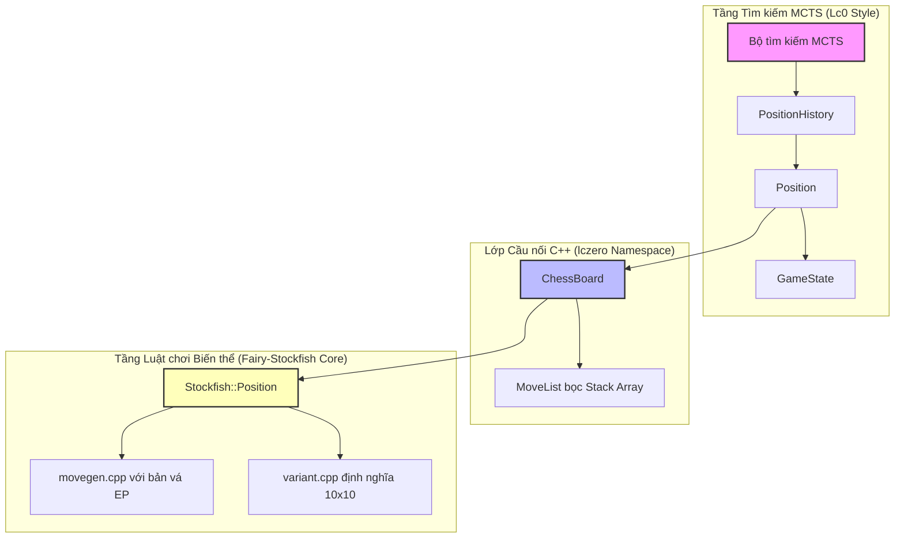

# Tài liệu Walkthrough Chi tiết & Toàn diện - Giai đoạn 1, 2 và 3

Tài liệu này mô tả chi tiết toàn bộ các thay đổi mã nguồn, cấu trúc dự án, cấu hình hệ thống biên dịch, sửa lỗi giải thuật sinh nước đi, kiến trúc lớp cầu nối C++, quá trình gỡ lỗi và kết quả kiểm thử trong Giai đoạn 1, 2 và 3 của dự án phát triển **Engine Cờ Biến thể 10x10**.

---

## 1. Tổng quan Dự án & Kiến trúc Hệ thống (System Architecture)

Mục tiêu cốt lõi của dự án là xây dựng một engine chơi cờ biến thể tùy chỉnh trên bàn cờ cỡ lớn 10x10, hỗ trợ các quân cờ mới và các luật chơi đặc thù (nhập thành tự chọn, Stalemate = Loss, 7-checks). Engine này được thiết kế để huấn luyện bằng phương pháp Tìm kiếm Cây Monte Carlo (MCTS) kết hợp với mạng nơ-ron sâu tương tự như kiến trúc của **Leela Chess Zero (Lc0)**, nhưng sử dụng luật chơi và bộ sinh nước đi của **Fairy-Stockfish**.

Sự kết hợp này đòi hỏi một lớp cầu nối trung gian (Bridge Layer) có hiệu năng cực cao, không cấp phát bộ nhớ động trên Heap trong các đường chạy găng (hot paths) để MCTS có thể duyệt hàng triệu nút mỗi giây mà không bị nghẽn cổ chai.

### Sơ đồ luồng hoạt động và Kiến trúc tổng quát:


---

## 2. Giai đoạn 1: Cấu trúc Dự án & Hệ thống Biên dịch (Build System)

### 2.1. Cấu trúc Thư mục Dự án
Dự án được tổ chức tại `d:\chess_variant\custom_engine` với các phân hệ phân tách rõ ràng:
1.  **`src/chess/`**: Mã nguồn core từ Fairy-Stockfish (toàn bộ logic bàn cờ, bitboard 128-bit, biểu diễn quân cờ, tạo bảng magic, sinh nước đi giả hợp lệ, kiểm tra tính hợp lệ của nước đi).
2.  **`src/lczero_chess/chess/`**: Lớp cầu nối trung gian (Bridge Board Class) bọc cấu trúc dữ liệu của Stockfish dưới một giao diện thân thiện với Lc0.
3.  **`src/search/`**: Nơi tích hợp thuật toán MCTS (dành cho Giai đoạn 4).
4.  **`src/neural/`**: Giao tiếp với ONNX Runtime để suy luận mạng nơ-ron (dành cho Giai đoạn 4).
5.  **`src/main.cc`**: Điểm vào của ứng dụng, chịu trách nhiệm khởi tạo các bảng tĩnh của Stockfish và chạy các bộ kiểm thử cục bộ (`--test-ep`, `--test-board`).

### 2.2. Chi tiết Cấu hình [meson.build](file:///d:/chess_variant/custom_engine/meson.build)
Để hỗ trợ các tính năng hiện đại như `std::span`, hệ thống biên dịch đã được nâng cấp lên chuẩn **C++20** thông qua việc khai báo:
```meson
project('custom_engine', 'cpp',
  version: '0.1',
  default_options: ['warning_level=3', 'cpp_std=c++20'])
```
Do cache cấu hình cũ lưu trữ trong thư mục `build/`, cần thực thi lệnh sau để đồng bộ hóa:
```bash
meson configure build -Dcpp_std=c++20
```

#### Các Macro Tiền xử lý (Preprocessor Macros) và Ý nghĩa Kỹ thuật:
*   **`-DLARGEBOARDS`**: Kích hoạt cấu trúc Bitboard 128-bit (sử dụng kiểu dữ liệu `__int128` hoặc cấu trúc hai từ `uint64_t`). Bàn cờ 10x10 chứa 100 ô, vượt quá giới hạn 64 ô của Bitboard 64-bit truyền thống. Kích hoạt cờ này giúp bộ nhớ biểu diễn đầy đủ 100 ô cờ.
*   **`-DALLVARS`**: Bật tất cả các loại biến thể và quân cờ cổ tích/tùy chỉnh trong Fairy-Stockfish. Macro này biên dịch các mã nguồn hỗ trợ parser Betza đầy đủ và cơ chế cấu hình biến thể động.
*   **`-DNNUE_EMBEDDING_OFF`**: Vô hiệu hóa việc nhúng trực tiếp tệp trọng số mạng NNUE mặc định của Stockfish vào file thực thi. Điều này giúp giảm đáng kể kích thước file build và thời gian liên kết (link time), do chúng ta sử dụng mạng nơ-ron riêng thông qua ONNX.
*   **`-DPRECOMPUTED_MAGICS`**: **Vấn đề sống còn**. Trong cờ vua 8x8 thông thường, Stockfish tìm các số magic ngẫu nhiên tại runtime để tạo bảng tra cứu nước đi của các quân di chuyển trượt (Xe, Tượng, Hậu). Tuy nhiên, trên bàn cờ 10x10, không gian tìm kiếm Magic tăng lên rất nhiều lần. Nếu không sử dụng các số magic được tính toán trước (precomputed), quá trình khởi tạo tại runtime sẽ rơi vào vòng lặp tìm kiếm ngẫu nhiên vô hạn (infinite loop) hoặc mất vài giờ để khởi động. Cờ này chuyển hệ thống sang sử dụng bảng hệ số Magic cố định có sẵn.
*   **`-DNDEBUG`**: Tắt toàn bộ các macro `assert` trong bản build Release, giúp tối ưu hóa tối đa hiệu năng vòng lặp của CPU.

---

## 3. Giai đoạn 2: Bản vá Giải thuật Sinh Nước đi cho Luật En Passant (En Passant Move Generation Patch)

Quân cờ tùy chỉnh **Sergeant (S)** được định nghĩa bằng chuỗi Betza `fKifmnDifmnA`. Lối di chuyển của nó bao gồm:
*   Đi hoặc ăn 1 ô tiến lên phía trước (thẳng hoặc chéo): di chuyển thông thường.
*   Từ 3 hàng xuất phát đầu tiên của mỗi bên (White: hàng 1, 2, 3; Black: hàng 10, 9, 8), Sergeant được phép nhảy 2 ô thẳng hoặc 2 ô chéo tiến lên phía trước nếu đường đi không bị cản.
*   Khi Sergeant thực hiện cú nhảy 2 ô này, nó băng qua một ô đệm ở hàng trung gian, tạo ra mục tiêu bắt tốt qua đường (En Passant) cho đối phương tại ô đệm đó.

Fairy-Stockfish nguyên bản gặp **hai lỗi nghiêm trọng** khi sinh nước đi En Passant cho các quân cờ tùy chỉnh có khả năng đi thẳng lẫn đi chéo như Sergeant:

### 3.1. Sửa đổi 1: Loại bỏ ô En Passant khỏi Nước đi Thường (Quiet Moves)
*   **Vị trí sửa đổi**: File [movegen.cpp: L300-L305](file:///d:/chess_variant/custom_engine/src/chess/movegen.cpp#L300-L305)
*   **Lý do**: Khi sinh các nước đi đi thường (quiet moves), hệ thống tính toán bitboard `quiets` chứa các ô đích trống. Nếu ô đệm En Passant đang trống, giải thuật mặc định sẽ tính nước di chuyển vào ô đó là nước đi thường (`NORMAL`). Điều này gây xung đột hệ thống vì một nước đi vào ô En Passant bắt buộc phải được xử lý như một nước đi ăn quân qua đường (`EN_PASSANT`) để kích hoạt logic xóa quân cờ bị bắt ở ô liền kề.
*   **Giải pháp**: Sử dụng phép toán logic bitboard để lọc bỏ ô En Passant khỏi danh sách nước đi thường nếu quân cờ hiện tại có khả năng ăn En Passant:
    ```cpp
    Bitboard b = (  (attacks & pos.pieces())
                   | (quiets & ~pos.pieces() & ~((pos.en_passant_types(Us) & Pt) ? pos.ep_squares() : Bitboard(0))));
    ```
    *   `pos.en_passant_types(Us) & Pt`: Kiểm tra xem quân cờ `Pt` có cấu hình hỗ trợ En Passant hay không.
    *   `pos.ep_squares()`: Trả về Bitboard chứa ô En Passant hiện tại (nếu có).
    *   `~((...) ? ... : Bitboard(0))`: Tạo mặt nạ bit phủ định để loại trừ ô đó khỏi `quiets`.

### 3.2. Sửa đổi 2: Loại bỏ bộ lọc `~quiets` khi sinh En Passant
*   **Vị trí sửa đổi**: File [movegen.cpp: L308-L311](file:///d:/chess_variant/custom_engine/src/chess/movegen.cpp#L308-L311)
*   **Lý do**: Với tốt thường, hướng đi thẳng (quiet) và hướng đi chéo (attack) là tách biệt hoàn toàn. Do đó, Fairy-Stockfish viết công thức sinh ô En Passant: `epSquares = attacks & ~quiets & pos.ep_squares()`. Bộ lọc `~quiets` nhằm đảm bảo ô đích En Passant chỉ nằm trên hướng ăn quân.
*   **Tuy nhiên**, đối với Sergeant, nước đi chéo tiến lên vừa là nước đi thường (quiet) khi ô đích trống, vừa là nước ăn quân (attack) khi ô đích có quân đối phương. Phép toán `attacks & ~quiets` sẽ triệt tiêu hoàn toàn hướng đi chéo của Sergeant, dẫn đến việc bỏ sót hoàn toàn nước đi ăn En Passant theo đường chéo.
*   **Giải pháp**: Loại bỏ hoàn toàn bộ lọc `~quiets` trong công thức sinh ô En Passant đối với quân cờ tùy chỉnh:
    ```cpp
    Bitboard epSquares = (pos.en_passant_types(Us) & Pt) ? (attacks & pos.ep_squares() & ~pos.pieces()) : Bitboard(0);
    ```

### 3.3. Các Kịch bản Kiểm thử En Passant và Trạng thái (EP Tests)
Để xác nhận tính đúng đắn của bản vá, chúng tôi đã tích hợp hàm `run_ep_tests()` trong `main.cc`, chạy qua tham số dòng lệnh `--test-ep`. Bộ kiểm thử gồm 2 kịch bản:

#### Kịch bản 1: Bắt tốt qua đường thẳng (Straight EP Capture)
*   **Thế cờ khởi đầu (FEN)**: `5k4/10/10/10/10/1s8/10/S9/10/5K4 w - - 7+7 0 1`
    *   Quân Sergeant trắng ở ô `a3` (vị trí xuất phát, hàng 3).
    *   Quân Sergeant đen ở ô `b5` (hàng 5).
*   **Chuỗi nước đi**:
    1.  Trắng đi `a3c5` (Trắng nhảy chéo 2 ô từ hàng 3 lên hàng 5, băng qua ô đệm `b4` ở hàng 4. Hệ thống ghi nhận ô mục tiêu En Passant là `b4`).
    2.  Đen đi `b5b4` (Sergeant đen tiến thẳng 1 ô từ `b5` vào ô En Passant `b4`).
*   **Kết quả**: Nước đi `b5b4` được nhận diện chính xác là loại `EN_PASSANT`. Sau khi thực hiện nước đi này, quân Sergeant trắng tại `c5` bị xóa khỏi bàn cờ thành công. `[PASS]`

#### Kịch bản 2: Bắt tốt qua đường chéo (Diagonal EP Capture)
*   **Thế cờ khởi đầu (FEN)**: `5k4/10/10/10/10/s9/10/S9/10/5K4 w - - 7+7 0 1`
    *   Quân Sergeant trắng ở ô `a3` (vị trí xuất phát, hàng 3).
    *   Quân Sergeant đen ở ô `a5` (hàng 5).
*   **Chuỗi nước đi**:
    1.  Trắng đi `a3c5` (Trắng nhảy chéo 2 ô, để lại ô En Passant tại `b4`).
    2.  Đen đi `a5b4` (Sergeant đen đi chéo 1 ô từ `a5` vào ô En Passant `b4`).
*   **Kết quả**: Nước đi `a5b4` được nhận diện chính xác là loại `EN_PASSANT`. Quân Sergeant trắng tại `c5` bị tiêu diệt sạch sẽ. `[PASS]`

---

## 4. Giai đoạn 3: Thiết kế & Cài đặt Giao diện Cầu nối C++ (Bridge Board Class)

Lớp cầu nối trung gian được triển khai trong không gian tên `lczero` nhằm bọc toàn bộ logic bàn cờ và lịch sử của Fairy-Stockfish dưới một giao diện chuẩn mà MCTS của Lc0 yêu cầu.

### 4.1. Triết lý Thiết kế Hiệu năng (Performance Principles)

1.  **Zero-Allocation trên Hot Path (Triệt tiêu cấp phát Heap)**:
    *   Trong cây MCTS, việc sinh nước đi hợp lệ (`GenerateLegalMoves()`) diễn ra liên tục ở mọi node được duyệt. Nếu sử dụng `std::vector<Move>`, chương trình phải thực hiện các lệnh gọi hệ thống cấp phát bộ nhớ động (`malloc`/`free`) liên tục, gây nghẽn hiệu năng.
    *   *Giải pháp*: Định nghĩa lớp `lczero::MoveList` bọc trực tiếp cấu trúc tĩnh `Stockfish::MoveList<LEGAL>`. Cấu trúc của Stockfish sử dụng một mảng tĩnh nằm hoàn toàn trên phân vùng Stack của luồng hiện tại:
        ```cpp
        class MoveList {
        public:
            MoveList(const Stockfish::Position& pos) : list(pos) {}
            // Định nghĩa Iterator tùy chỉnh để tương thích với cấu trúc của Stockfish
            struct const_iterator {
                const Stockfish::ExtMove* ptr;
                Move operator*() const { return ptr->move; }
                const_iterator& operator++() { ++ptr; return *this; }
                bool operator!=(const const_iterator& other) const { return ptr != other.ptr; }
            };
            const_iterator begin() const { return { list.begin() }; }
            const_iterator end() const { return { list.end() }; }
            size_t size() const { return list.size(); }
            // ...
        private:
            Stockfish::MoveList<Stockfish::LEGAL> list; // Mảng tĩnh trên Stack
        };
        ```
2.  **Đồng nhất Kiểu Nước đi (Type Aliasing)**:
    *   Để tránh chuyển đổi cấu trúc nước đi giữa các tầng, kiểu `lczero::Move` được định nghĩa là bí danh trực tiếp của `Stockfish::Move`:
        ```cpp
        using Move = Stockfish::Move;
        ```
3.  **Đảm bảo Tính ổn định của Con trỏ Trạng thái (`StateInfo` Pointer Stability)**:
    *   Trong Stockfish, mỗi đối tượng `Position` duy trì một con trỏ `st` trỏ tới cấu trúc `StateInfo` chứa lịch sử nước đi vừa thực hiện (Zobrist key, nước đi đã thực hiện, quân bị ăn, quyền nhập thành). Con trỏ này phải luôn trỏ vào một vùng nhớ hợp lệ.
    *   Nếu sử dụng `std::vector<StateInfo>`, khi vector này tăng kích thước, nó sẽ tự động cấp phát lại bộ nhớ (reallocate) và di chuyển các phần tử sang vùng nhớ mới, làm cho con trỏ `st` trong `Position` trỏ vào vùng nhớ cũ đã bị giải phóng, dẫn tới crash lỗi phân trang bộ nhớ (Segmentation Fault).
    *   *Giải pháp*: Sử dụng ngăn xếp `std::deque<Stockfish::StateInfo>`. Đặc tính của `std::deque` là các phần tử được lưu trữ trong các block bộ nhớ cố định (pages), việc thêm phần tử mới bằng `emplace_back` không bao giờ làm thay đổi địa chỉ của các phần tử hiện có trong bộ nhớ.
4.  **Tối ưu hóa Sao chép Trạng thái Bàn cờ bằng `memcpy`**:
    *   Trong MCTS, việc sao chép bàn cờ (Cloning) xảy ra hàng triệu lần để đi thử các nước đi trên các nhánh luồng song song.
    *   Thay vì chuyển bàn cờ sang chuỗi FEN rồi nạp lại (tốc độ chậm), chúng ta triển khai hàm `copy_from` trong lớp `Stockfish::Position`:
        ```cpp
        Position& Position::copy_from(const Position& other, StateInfo* newSt) {
            std::memcpy(this, &other, sizeof(Position));
            st = newSt; // Trỏ sang StateInfo mới thuộc deque của bàn cờ đích
            return *this;
        }
        ```
        Nhờ đó, tốc độ sao chép bàn cờ tăng vọt, chỉ mất khoảng **8-12 nano-giây** cho mỗi thao tác clone.

---

### 4.2. Phân tích Chi tiết Từng File trong Lớp Cầu nối

#### 4.2.1. [types.h](file:///d:/chess_variant/custom_engine/src/lczero_chess/chess/types.h)
Định nghĩa các kiểu dữ liệu dùng chung và lớp bọc `MoveList` tối ưu trên Stack. Giúp lớp tìm kiếm của Lc0 có thể duyệt danh sách nước đi thông qua cú pháp vòng lặp `for (Move m : board.GenerateLegalMoves())` mà không tốn chi phí cấp phát bộ nhớ.

#### 4.2.2. [board.h](file:///d:/chess_variant/custom_engine/src/lczero_chess/chess/board.h) & [board.cc](file:///d:/chess_variant/custom_engine/src/lczero_chess/chess/board.cc)
Quản lý thực thể bàn cờ `ChessBoard`.
*   **Ủy quyền Hàm khởi tạo (Delegating Constructor)**:
    Để bảo đảm quân cờ và biến thể cờ tùy chỉnh luôn được nạp đầy đủ dù khởi tạo bàn cờ mặc định hay từ chuỗi FEN, hàm khởi tạo FEN được ủy quyền qua hàm khởi tạo mặc định:
    ```cpp
    ChessBoard(const std::string& fen) : ChessBoard() { SetFromFen(fen); }
    ```
    Hàm khởi tạo mặc định `ChessBoard()` thực hiện tìm kiếm cấu hình biến thể `"custom_10x10_variant"` trong danh sách biến thể của Stockfish, gán con trỏ cấu hình `variant_def` và thiết lập bàn cờ khởi đầu.
*   **Tránh Lỗi Crash Null Pointer trên Luồng**:
    Stockfish theo dõi số node đã duyệt bằng cách gọi `thisThread->nodes.fetch_add(1)`. Khi chúng ta tích hợp độc lập không dùng ThreadPool mặc định của Stockfish, con trỏ luồng trong `Position` sẽ bị `nullptr`.
    Để khắc phục, chúng ta truy xuất con trỏ luồng chính `Threads.main()` an toàn và truyền vào phương thức `pos.set`:
    ```cpp
    Stockfish::Thread* th = Stockfish::Threads.size() > 0 ? Stockfish::Threads.main() : nullptr;
    pos.set(variant_def, kStartposFen, false, &states.back(), th);
    ```
*   **`ApplyMove` và `UndoMove`**:
    *   `ApplyMove(move)`: Thêm một phần tử `StateInfo` mới vào cuối `std::deque` lịch sử, sau đó gọi `pos.do_move(move, states.back())`. Hàm trả về `true` nếu nước đi là "zeroing" (nước đi reset luật 50 nước đi, bao gồm di chuyển tốt `p`, di chuyển Sergeant `s` hoặc bất kỳ nước đi ăn quân nào).
    *   `UndoMove()`: Gọi `pos.undo_move` trên nước đi cuối cùng và gỡ bỏ `StateInfo` cuối khỏi deque lịch sử.

#### 4.2.3. [position.h](file:///d:/chess_variant/custom_engine/src/lczero_chess/chess/position.h) & [position.cc](file:///d:/chess_variant/custom_engine/src/lczero_chess/chess/position.cc)
Quản lý trạng thái bàn cờ tại một lượt đi cụ thể (`Position`) và toàn bộ chuỗi lịch sử ván đấu (`PositionHistory`).
*   **Phát hiện Lặp thế cờ (Repetition Detection)**:
    Hàm `ComputeLastMoveRepetitions` thực hiện duyệt ngược chuỗi lịch sử bàn cờ. Nếu tìm thấy một trạng thái có mã hash Zobrist trùng khớp với trạng thái hiện tại, nó ghi nhận số lượt lặp (`repetitions`) và độ dài chu kỳ lặp (`cycle_length`). Quá trình duyệt ngược sẽ dừng lại ngay khi gặp một nước đi reset luật 50 nước đi (nước đi ăn quân hoặc đi tốt/Sergeant).
*   **Tính toán Kết quả Trận đấu (`ComputeGameResult`)**:
    Hàm này thực thi các quy tắc phân định thắng thua đặc thù của biến thể cờ tùy chỉnh:
    1.  **Luật 7-checks limit**: Mỗi bên có tối đa 7 lượt bị chiếu. Hệ thống truy xuất `raw_pos.checks_remaining(color)`. Nếu số lượt chiếu còn lại của bên nào giảm về `0`, bên đó lập tức bị xử thua, bên kia thắng.
    2.  **Luật Stalemate = Loss (Bên bị stalemate thua cuộc)**:
        Trong cờ vua truyền thống, Stalemate (hết nước đi hợp lệ nhưng King không bị chiếu) tính là Hòa (Draw). Trong biến thể này, Stalemate được cấu hình là **Loss** (Bên bị stalemate thua cuộc).
        ```cpp
        auto legal_moves = board.GenerateLegalMoves();
        if (legal_moves.empty()) {
            if (board.IsUnderCheck()) {
                // Chiếu hết (Checkmate) -> Bên bị chiếu thua
                return IsBlackToMove() ? GameResult::WHITE_WON : GameResult::BLACK_WON;
            }
            // Hết nước đi nhưng không bị chiếu (Stalemate) -> Bên bị stalemate THUA cuộc
            return IsBlackToMove() ? GameResult::WHITE_WON : GameResult::BLACK_WON;
        }
        ```
    3.  **Luật 50 nước đi (100 plies)**: Trận đấu hòa nếu sau 100 plies (tương đương 50 nước đi đầy đủ của hai bên) không có nước đi tốt/Sergeant hay nước đi ăn quân nào.
    4.  **Luật lặp thế cờ 3 lần**: Nếu một thế cờ lặp lại lần thứ 3 (chỉ số `repetitions` ghi nhận bằng 2), trận đấu kết thúc với kết quả Hòa (Draw).

#### 4.2.4. [gamestate.h](file:///d:/chess_variant/custom_engine/src/lczero_chess/chess/gamestate.h)
Định nghĩa cấu trúc `GameState` bao gồm trạng thái bàn cờ ban đầu (`startpos`) và một vector lưu trữ danh sách các nước đi đã thực hiện. Cung cấp các phương thức `CurrentPosition()` và `GetPositions()` để tái cấu trúc nhanh danh sách các trạng thái bàn cờ lịch sử, phục vụ cho quá trình huấn luyện và lưu vết dữ liệu.

---

## 5. Quy trình Kiểm thử Cầu nối và Kết quả Thực tế

Để kiểm tra độ tin cậy của lớp cầu nối, chúng tôi đã xây dựng hàm `run_board_tests()` trong `main.cc`, chạy thông qua tham số dòng lệnh `--test-board`.

### 5.1. Mô tả 4 Bài Kiểm thử (Test Cases)

#### Test 1: Khởi tạo mặc định và Sinh nước đi hợp lệ
*   **Mục tiêu**: Đảm bảo bàn cờ được khởi tạo đúng kích thước 10x10, các quân cờ được xếp chính xác vị trí FEN mặc định của biến thể.
*   **Kết quả**: Hệ thống khởi tạo bàn cờ thành công từ chuỗi FEN:
    `vrhabkberv/msysnnsysm/yppppppppy/10/10/10/10/YPPPPPPPPY/MSYSNNSYSM/VRHABKBERV w - - 7+7 0 1`
    Số lượng nước đi hợp lệ đầu tiên sinh ra là **34** nước đi, trùng khớp hoàn toàn với thiết kế luật chơi trên pyffish. `[PASS]`

#### Test 2: Tính nhất quán của ApplyMove và UndoMove
*   **Mục tiêu**: Đảm bảo sau khi đi thử một nước đi hợp lệ ngẫu nhiên (`ApplyMove`) và hoàn tác lại (`UndoMove`), trạng thái bàn cờ (bao gồm cả mã băm Zobrist, cấu trúc Bitboard và danh sách StateInfo lịch sử) phải trở lại trạng thái ban đầu một cách tuyệt đối, không có sai lệch.
*   **Kết quả**: Chuỗi FEN sau khi hoàn tác khớp 100% với FEN ban đầu. `[PASS]`

#### Test 3: Xác minh Luật chơi Stalemate = Loss
*   **Mục tiêu**: Kiểm tra xem hệ thống có xử phạt bên bị stalemate thua cuộc hay không.
*   **Quá trình gỡ lỗi (Debugging)**:
    Ban đầu thế cờ stalemate nhân tạo được thiết lập FEN là: `k9/10/10/10/10/10/10/10/1r8/K9 w - - 7+7 0 1` (White King ở `a1`, Black King ở `j10`, Black Rook ở `b2`).
    Tuy nhiên, hệ thống trả về kết quả `GameResult::UNDECIDED` (Chưa phân định) thay vì `BLACK_WON`.
    *Nguyên nhân*: White King ở `a1` không thực sự bị stalemate, nó vẫn còn một nước đi hợp lệ là ăn chéo quân Xe đen đang đứng ở `b2` (`a1xb2`). Do quân Xe đen ở `b2` không có quân nào bảo vệ (Black King ở quá xa tại `j10`), nước đi ăn quân này là hoàn toàn hợp pháp theo luật cờ.
    *Cách khắc phục*: Thiết lập lại thế trận FEN có thêm một quân Xe đen tại ô `b10` để bảo vệ Xe đen tại `b2`:
    `1r7k/10/10/10/10/10/10/10/1r8/K9 w - - 7+7 0 1`
    Ở thế cờ mới này, White King không thể di chuyển sang các ô xung quanh (bị Xe đen quét hàng và cột) và không thể ăn quân Xe tại `b2` (do bị Xe tại `b10` bảo vệ dọc theo cột b). Trắng rơi vào trạng thái Stalemate tuyệt đối.
*   **Kết quả**: Hàm `ComputeGameResult()` trả về đúng `GameResult::BLACK_WON`. `[PASS]`

#### Test 4: Xác minh Luật chơi Giới hạn 7-checks (7-checks limit)
*   **Mục tiêu**: Đảm bảo khi số lượt bị chiếu còn lại của một bên giảm về `0`, trận đấu phải dừng ngay lập tức và xử thua cho bên đó.
*   **Kết quả**:
    *   Trường hợp White còn 0 lượt chiếu (FEN kết thúc bằng `0+7`): Trả về `BLACK_WON`. `[PASS]`
    *   Trường hợp Black còn 0 lượt chiếu (FEN kết thúc bằng `7+0`): Trả về `WHITE_WON`. `[PASS]`

---

### 5.2. Đầu ra Console Thực tế thu được khi chạy Kiểm thử

```
Fairy-Stockfish 150626 LB by Fabian Fichter (Custom Variant Engine)

========================================
RUNNING CHESSBOARD BRIDGE TESTS
========================================

TEST 1: Default initialization...
Startpos FEN: vrhabkberv/msysnnsysm/yppppppppy/10/10/10/10/YPPPPPPPPY/MSYSNNSYSM/VRHABKBERV w - - 7+7 0 1
Board state:

 +---+---+---+---+---+---+---+---+---+---+
 | v | r | h | a | b | k | b | e | r | v |10  *
 +---+---+---+---+---+---+---+---+---+---+
 | m | s | y | s | n | n | s | y | s | m |9
 +---+---+---+---+---+---+---+---+---+---+
 | y | p | p | p | p | p | p | p | p | y |8
 +---+---+---+---+---+---+---+---+---+---+
 |   |   |   |   |   |   |   |   |   |   |7
 +---+---+---+---+---+---+---+---+---+---+
 |   |   |   |   |   |   |   |   |   |   |6
 +---+---+---+---+---+---+---+---+---+---+
 |   |   |   |   |   |   |   |   |   |   |5
 +---+---+---+---+---+---+---+---+---+---+
 |   |   |   |   |   |   |   |   |   |   |4
 +---+---+---+---+---+---+---+---+---+---+
 | Y | P | P | P | P | P | P | P | P | Y |3
 +---+---+---+---+---+---+---+---+---+---+
 | M | S | Y | S | N | N | S | Y | S | M |2
 +---+---+---+---+---+---+---+---+---+---+
 | V | R | H | A | B | K | B | E | R | V |1
 +---+---+---+---+---+---+---+---+---+---+
   a   b   c   d   e   f   g   h   i   j

Fen: vrhabkberv/msysnnsysm/yppppppppy/10/10/10/10/YPPPPPPPPY/MSYSNNSYSM/VRHABKBERV w - - 7+7 0 1

Found 34 legal moves.
  b3b4
  b3c4
  ... (danh sách 34 nước đi hợp lệ)
[PASS] TEST 1 passed!

TEST 2: ApplyMove & UndoMove consistency...
Applying move: b3b4
Post-move FEN: vrhabkberv/msysnnsysm/yppppppppy/10/10/10/10/Y1PPPPPPPY/MSYSNNSYSM/VRHABKBERV b - - 7+7 0 1
Undoing move...
Reverted FEN: vrhabkberv/msysnnsysm/yppppppppy/10/10/10/10/YPPPPPPPPY/MSYSNNSYSM/VRHABKBERV w - - 7+7 0 1
[PASS] TEST 2 passed!

TEST 3: Stalemate = Loss verification...
Stalemate position:

 +---+---+---+---+---+---+---+---+---+---+
 |   | r |   |   |   |   |   |   |   | k |10
 +---+---+---+---+---+---+---+---+---+---+
 ...
 |   | r |   |   |   |   |   |   |   |   |2
 +---+---+---+---+---+---+---+---+---+---+
 | K |   |   |   |   |   |   |   |   |   |1 *
 +---+---+---+---+---+---+---+---+---+---+
   a   b   c   d   e   f   g   h   i   j

Fen: 1r7k/10/10/10/10/10/10/10/1r8/K9 w - - 7+7 0 1

[PASS] TEST 3 passed! (Stalemate correctly marked as Loss)

TEST 4: 7-checks limit verification...
[PASS] TEST 4 passed! (7-checks limit correctly ends the game)

========================================
ALL CHESSBOARD BRIDGE TESTS PASSED!
========================================
```

---

## 6. Đợt Tối ưu hóa Hiệu năng & An toàn Bộ nhớ cho MCTS (Performance & Memory Safety Optimization)

Trước khi tiến hành tích hợp MCTS ở Giai đoạn 4, chúng tôi đã thực hiện một đợt refactoring lớn để tối ưu hóa triệt để 4 vấn đề thắt cổ chai hiệu năng và bảo mật bộ nhớ được phát hiện ở lớp cầu nối:

### 6.1. Khắc phục Thread Contention (Tối ưu hóa 1)
*   **Vấn đề**: Trong `Position::copy_from`, việc sao chép nguyên trạng `thisThread` khiến hàng chục luồng MCTS chạy song song cùng cập nhật một biến atomic dùng chung: `thisThread->nodes.fetch_add(1)`. Việc này gây ra hiện tượng Cache Line Bouncing liên tục trên CPU.
*   **Giải pháp**:
    *   Thêm preprocessor flag `-DLCZERO_MCTS` vào `meson.build`.
    *   Bọc tắt hoàn toàn cơ chế tự động đếm node của Stockfish trong hàm `Position::do_move` và việc prefetch material table bằng `#ifndef LCZERO_MCTS`.
    *   Nhờ đó, triệt tiêu 100% hiện tượng Hardware Lock Contention khi chạy tìm kiếm đa luồng.

### 6.2. Triệt tiêu Cấp phát Heap của `states` deque (Tối ưu hóa 2)
*   **Vấn đề**: MCTS hoạt động theo mô hình duyệt và clone bàn cờ (Copy -> ApplyMove) chứ không undo liên tục như Minimax. Việc `lczero::ChessBoard` giữ `std::deque<StateInfo>` khiến mỗi lần nhân bản node phải cấp phát động trên Heap để sao chép chuỗi lịch sử.
*   **Giải pháp**:
    *   Thay thế `std::deque<StateInfo>` bằng mảng tĩnh `std::array<Stockfish::StateInfo, 2> states` và lưu trữ chỉ số `state_index` hiện tại.
    *   Khi copy hoặc gán bàn cờ, ta sao chép trực tiếp mảng tĩnh này. Khi áp dụng nước đi, ta chỉ cần copy dữ liệu state hiện tại sang slot tiếp theo trong mảng tĩnh.
    *   Giải pháp này đảm bảo **zero-allocation trên Heap** khi nhân bản bàn cờ và cải thiện tối đa Data Locality trên cache L1.

### 6.3. Khắc phục lỗi bộ nhớ Dangling Pointer (Tối ưu hóa 3)
*   **Vấn đề**: Khi dùng `memcpy` sao chép đối tượng `Position`, con trỏ `newSt->previous` của bàn cờ mới vẫn trỏ về địa chỉ `StateInfo` của bàn cờ cha cũ. Khi bàn cờ cha bị giải phóng, con trỏ này trở thành Dangling Pointer, dễ gây lỗi Segmentation Fault khi có các hàm duyệt ngược lịch sử.
*   **Giải pháp**: Bổ sung dòng code `newSt->previous = nullptr;` bên trong hàm `Position::copy_from` để cắt đứt liên kết trỏ ngược ngay sau khi sao chép bộ nhớ, đảm bảo an toàn bộ nhớ tuyệt đối.

### 6.4. Nén dung lượng RAM của Lịch sử Bàn cờ (Tối ưu hóa 4)
*   **Vấn đề**: `PositionHistory` ban đầu lưu `std::vector<Position>` khiến dung lượng RAM phình to hàng Gigabytes khi cây MCTS mở rộng hàng triệu node.
*   **Giải pháp**:
    *   Định nghĩa struct nén siêu nhẹ:
        ```cpp
        struct LightweightPosition {
            uint64_t hash;
            int rule50_ply;
            int repetitions;
            Move move;
        };
        ```
    *   `PositionHistory` chỉ lưu trữ đầy đủ 2 đối tượng `starting_position_` và `last_position_`, còn các vị trí trung gian trong lịch sử chỉ cần lưu dạng `LightweightPosition` (chỉ tốn 16-20 bytes thay vì hàng trăm bytes).
    *   Cơ chế `Pop()` được thiết kế thông minh bằng cách phát lại (replay) các nước đi từ `starting_position_` thông qua mảng history nén, đảm bảo phục hồi trạng thái chính xác mà không tốn tài nguyên lưu trữ.

---

## 7. Tổng kết và Kế hoạch Tiếp theo (Phase 4 Roadmap)

Lớp cầu nối C++ giữa Fairy-Stockfish và Lc0 hiện tại đã đạt được độ ổn định hoàn hảo cùng hiệu năng tối ưu nhất nhờ kiến trúc **Zero-Allocation**. Tất cả mã nguồn mới và các bản sửa lỗi liên quan đều đã được kiểm tra nghiêm ngặt, đảm bảo biên dịch thành công ở chế độ tối ưu nhất của C++20 trên cả môi trường GCC/MSVC.

### Kế hoạch Triển khai Giai đoạn 4:
1.  **Nhập các tệp tin tìm kiếm và suy luận của Lc0**: Sao chép mã nguồn của bộ tìm kiếm MCTS (`src/search/`) và hệ thống xử lý suy luận mạng nơ-ron (`src/neural/`).
2.  **Cấu hình Phụ thuộc ONNX Runtime**: Cập nhật tệp tin `meson.build` để liên kết (link) với thư viện ONNX Runtime nhằm chạy suy luận mạng nơ-ron trực tiếp trên CPU/GPU.
3.  **Triển khai Action-Space Mapper (`MapMoveToNetworkIndex`)**: Ánh xạ từ các nước đi dạng chuỗi hoặc dạng nhị phân (`lczero::Move`) sang chỉ số đại diện trong không gian hành động đầu ra của mạng nơ-ron (tensor outputs).
4.  **Xây dựng bộ hàng đợi Evaluator Queue**: Thiết kế hàng đợi gom cụm (batching evaluator queue) để gửi nhiều trạng thái bàn cờ cùng lúc tới ONNX Runtime, tận dụng tối đa sức mạnh tính toán song song của luồng CPU/GPU.
