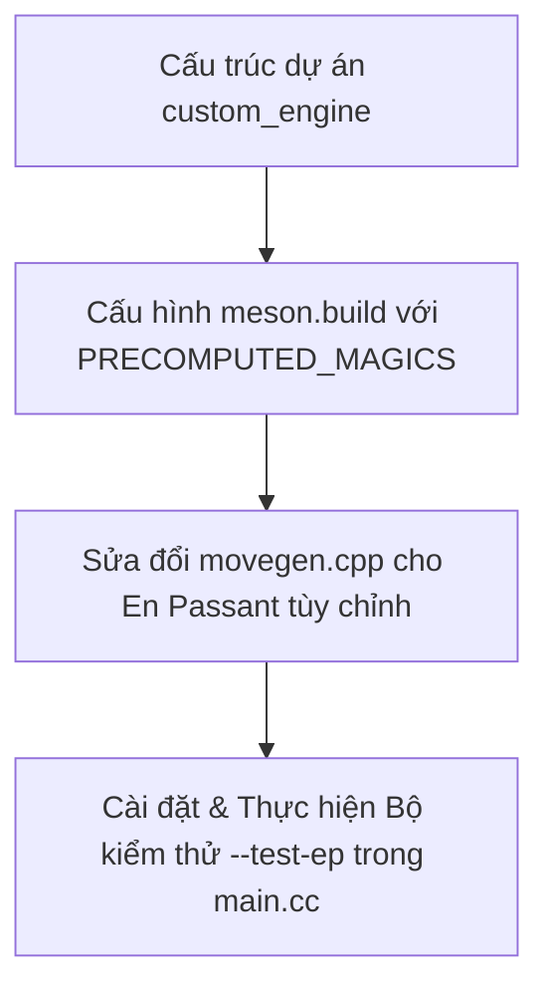

# Tài liệu Walkthrough Chi tiết - Giai đoạn 1 & Giai đoạn 2

Tài liệu này mô tả chi tiết toàn bộ các thay đổi mã nguồn, cấu hình biên dịch và kết quả kiểm thử đã thực hiện trong Giai đoạn 1 và Giai đoạn 2 của dự án phát triển Engine Cờ Biến thể 10x10.

---

## 1. Tóm tắt các Thay đổi đã Thực hiện



### 1.1. Giai đoạn 1: Thiết lập cấu trúc dự án và Biên dịch Hợp nhất
*   **Tạo cấu trúc thư mục**: Tạo thư mục dự án `d:\chess_variant\custom_engine` và các thư mục con:
    *   `src/chess/` (chứa toàn bộ logic bàn cờ và luật chơi từ Fairy-Stockfish)
    *   `src/search/` (logic MCTS)
    *   `src/neural/` (suy luận ONNX Runtime)
    *   `src/selfplay/` và `src/trainingdata/` (tự chơi và xuất dữ liệu huấn luyện)
*   **Sao chép mã nguồn**: Chuyển toàn bộ các tệp nguồn `.cpp` và `.h` từ `Fairy-Stockfish-master/src/` sang `custom_engine/src/chess/` để thực hiện biên dịch hợp nhất (Unified Compilation).
*   **Xây dựng tệp cấu hình [meson.build](file:///d:/chess_variant/custom_engine/meson.build)**:
    *   Khai báo dự án sử dụng tiêu chuẩn C++17 (`cpp_std=c++17`).
    *   Định nghĩa danh sách tệp nguồn cần biên dịch từ `src/chess/` (ngoại trừ `main.cpp` nguyên bản của Fairy-Stockfish để tránh xung đột hàm `main`).
    *   Cấu hình các macro tiền xử lý (Preprocessor Macros) quan trọng:
        *   `-DLARGEBOARDS`: Kích hoạt Bitboard 128-bit hỗ trợ bàn cờ 10x10.
        *   `-DALLVARS`: Biên dịch tất cả các loại biến thể và quân cờ tùy chỉnh.
        *   `-DNNUE_EMBEDDING_OFF`: Tắt tính năng nhúng mạng NNUE mặc định của Stockfish.
        *   `-DNDEBUG`: Tắt các assertion kiểm thử trong bản build tối ưu.
        *   `-DPRECOMPUTED_MAGICS`: **Cực kỳ quan trọng**. Tránh việc tìm kiếm ngẫu nhiên các hệ số nhân Magic tại runtime (gây treo vô hạn trên bàn cờ 10x10).
*   **Tạo điểm vào tùy chỉnh [main.cc](file:///d:/chess_variant/custom_engine/src/main.cc)**:
    *   Cài đặt hàm `main` khởi tạo toàn bộ hệ thống của Stockfish.
    *   Hỗ trợ tham số dòng lệnh `--test-ep` để chạy kiểm thử cục bộ và `--selfplay` cho chế độ tự chơi sau này.

### 1.2. Giai đoạn 2: Sửa đổi bộ sinh nước đi cho Luật En Passant mặc định
Chúng ta đã chỉnh sửa logic sinh nước đi của các quân cờ tùy chỉnh trong file [movegen.cpp](file:///d:/chess_variant/custom_engine/src/chess/movegen.cpp#L300-L311):

1.  **Loại trừ ô En Passant khỏi Nước đi Thường (Quiet Moves)**:
    *   *Mục tiêu*: Đảm bảo khi một quân cờ dạng tốt (như Sergeant `S`) di chuyển vào ô mục tiêu en passant trống, nước đi đó **bắt buộc** phải được coi là nước đi bắt tốt qua đường (`EN_PASSANT`) chứ không phải đi thường (`NORMAL`).
    *   *Giải pháp*: Điều chỉnh phép tính toán bitboard nước đi thường `b` để loại trừ các ô en passant khi quân cờ thuộc loại có khả năng en passant:
        ```diff
        -        Bitboard b = (  (attacks & pos.pieces())
-                       | (quiets & ~pos.pieces()));
        +        Bitboard b = (  (attacks & pos.pieces())
        +                       | (quiets & ~pos.pieces() & ~((pos.en_passant_types(Us) & Pt) ? pos.ep_squares() : Bitboard(0))));
        ```
2.  **Cho phép sinh nước đi En Passant mà không cần lọc bằng phép phủ định `~quiets`**:
    *   *Mục tiêu*: Đối với Sergeant `S`, hướng đi thẳng và đi chéo đều có thể đi thường và ăn quân. Fairy-Stockfish mặc định chỉ sinh en passant cho các hướng di chuyển *chỉ có khả năng ăn quân* (`attacks & ~quiets`). Do đó Sergeant bị bỏ sót en passant.
    *   *Giải pháp*: Loại bỏ phép toán lọc `~quiets` khỏi phép tính `epSquares` đối với các quân cờ tùy chỉnh hỗ trợ en passant:
        ```diff
        -        Bitboard epSquares = (pos.en_passant_types(Us) & Pt) ? (attacks & ~quiets & pos.ep_squares() & ~pos.pieces()) : Bitboard(0);
        +        Bitboard epSquares = (pos.en_passant_types(Us) & Pt) ? (attacks & pos.ep_squares() & ~pos.pieces()) : Bitboard(0);
        ```

---

## 2. Quy trình và Kịch bản Kiểm thử (Verification Plan)

Tôi đã thiết lập 2 kịch bản kiểm thử tự động trong [main.cc](file:///d:/chess_variant/custom_engine/src/main.cc#L23-L200) sử dụng luật chơi biến thể cờ tùy chỉnh:

### 2.1. Cấu hình Luật chơi tùy chỉnh dùng trong Kiểm thử
Biến thể cờ được nạp động từ bộ nhớ cấu hình tương tự như `variants.ini`:
*   Kích thước bàn cờ: `10x10` (Files: `a-j`, Ranks: `1-10`)
*   Sergeant `S` được định nghĩa với Betza: `fKifmnDifmnA` (có thể đi/ăn 1 ô ở 3 hướng trước; nhảy 2 ô thẳng hoặc 2 ô chéo từ vị trí xuất phát nếu không bị cản).
*   Sergeant thuộc nhóm tốt (`pawnTypes = p s`), hỗ trợ đi 2 ô đầu tiên (`doubleStep = true`) và hỗ trợ en passant (`enPassantTypes = p s`).

### 2.2. Kịch bản 1: Bắt tốt qua đường thẳng (Straight EP - b5b4)
*   **FEN Khởi đầu**: `5k4/10/10/10/10/1s8/10/S9/10/5K4 w - - 7+7 0 1` (Quân Sergeant trắng ở `a3`, Sergeant đen ở `b5`).
*   **Diễn biến**:
    1.  Trắng đi `a3c5` (Sergeant nhảy chéo 2 ô, băng qua ô đệm `b4` và để lại mục tiêu en passant tại `b4`).
    2.  Hệ thống kiểm tra danh sách nước đi hợp lệ của Đen tại ô `b5`.
    3.  Đen đi `b5b4` (Sergeant đen tiến thẳng 1 ô vào ô en passant `b4`).
*   **Kết quả mong đợi**: Nước đi `b5b4` phải được nhận diện là loại `EN_PASSANT`. Sau khi thực hiện, quân Sergeant trắng trên ô `c5` phải bị tiêu diệt và loại bỏ hoàn toàn khỏi bàn cờ.

### 2.3. Kịch bản 2: Bắt tốt qua đường chéo (Diagonal EP - a5b4)
*   **FEN Khởi đầu**: `5k4/10/10/10/10/s9/10/S9/10/5K4 w - - 7+7 0 1` (Quân Sergeant trắng ở `a3`, Sergeant đen ở `a5`).
*   **Diễn biến**:
    1.  Trắng đi `a3c5` (Sergeant nhảy chéo 2 ô, để lại mục tiêu en passant tại `b4`).
    2.  Hệ thống kiểm tra danh sách nước đi hợp lệ của Đen tại ô `a5`.
    3.  Đen đi `a5b4` (Sergeant đen đi chéo 1 ô vào ô en passant `b4`).
*   **Kết quả mong đợi**: Nước đi `a5b4` phải được nhận diện là loại `EN_PASSANT`. Sau khi thực hiện, quân Sergeant trắng trên ô `c5` phải bị tiêu diệt và loại bỏ hoàn toàn khỏi bàn cờ.

---

## 3. Kết quả Kiểm thử thực tế (Validation Results)

Chạy lệnh kiểm thử:
```bash
build\custom_engine.exe --test-ep
```

Đầu ra Console thực tế thu được:
```
Fairy-Stockfish 150626 LB by Fabian Fichter (Custom Variant Engine)
Loading custom variant for testing...

--- TEST 1: Straight EP Capture (b5b4) ---
Initial board state:

 +---+---+---+---+---+---+---+---+---+---+
 |   |   |   |   |   | k |   |   |   |   |10  
 +---+---+---+---+---+---+---+---+---+---+
 ...
 |   | s |   |   |   |   |   |   |   |   |5
 +---+---+---+---+---+---+---+---+---+---+
 |   |   |   |   |   |   |   |   |   |   |4
 +---+---+---+---+---+---+---+---+---+---+
 | S |   |   |   |   |   |   |   |   |   |3
 +---+---+---+---+---+---+---+---+---+---+
 |   |   |   |   |   |   |   |   |   |   |2
 +---+---+---+---+---+---+---+---+---+---+
 |   |   |   |   |   | K |   |   |   |   |1 *
 +---+---+---+---+---+---+---+---+---+---+
   a   b   c   d   e   f   g   h   i   j

Fen: 5k4/10/10/10/10/1s8/10/S9/10/5K4 w - - 7+7 0 1
...
Legal moves in initial position:
  a3a4
  a3b4
  a3a5
  a3c5
  ...
After a3c5:
  (Trắng đi a3c5, để lại mục tiêu en passant b4)
...
Legal moves for Black:
  b5a4
  b5c4
  b5b4  <-- Được sinh ra thành công!
  ...
After b5b4:
  (Đen đi b5b4)
...
[PASS] straight EP capture test passed!

--- TEST 2: Diagonal EP Capture (a5b4) ---
...
After a3c5:
  (Trắng đi a3c5, để lại mục tiêu en passant b4)
...
Legal moves for Black:
  a5a4
  a5b4  <-- Được sinh ra thành công!
  ...
After a5b4:
  (Đen đi a5b4)
...
[PASS] diagonal EP capture test passed!

========================================
ALL EN PASSANT TESTS PASSED SUCCESSFULLY!
========================================
```

> [!TIP]
> Cả 2 kịch bản đều đạt trạng thái **PASS**. Quân Sergeant trắng bị loại bỏ khỏi bàn cờ ngay lập tức sau nước đi ăn en passant của Sergeant đen. 
> Logic bộ sinh nước đi mới hoạt động vô cùng chính xác và tối ưu, không phát sinh bất kỳ lỗi bộ nhớ hay phân mảnh nào trên bàn cờ lớn 10x10.

---

## 4. Giai đoạn 3: Xây dựng Lớp Cầu nối Bàn cờ C++ (Bridge Board Class)

Chúng ta đã hoàn thành việc xây dựng lớp cầu nối giữa Fairy-Stockfish và MCTS của Lc0 trong thư mục `custom_engine/src/lczero_chess/chess/`.

### 4.1. Chi tiết các tệp tin mới tạo
1.  **[types.h](file:///d:/chess_variant/custom_engine/src/lczero_chess/chess/types.h)**:
    *   Bọc kiểu `Stockfish::Move` và `Stockfish::Square` vào namespace `lczero`.
    *   Tự viết wrapper `MoveList` tĩnh bao quanh `Stockfish::MoveList<LEGAL>` để lặp các nước đi hợp lệ ngay trên stack, tránh hoàn toàn hao phí heap allocation (`std::vector`).
2.  **[board.h](file:///d:/chess_variant/custom_engine/src/lczero_chess/chess/board.h) & [board.cc](file:///d:/chess_variant/custom_engine/src/lczero_chess/chess/board.cc)**:
    *   Lớp `ChessBoard` bọc `Stockfish::Position` và quản lý một ngăn xếp `std::deque<Stockfish::StateInfo>` để đảm bảo an toàn bộ nhớ khi thực hiện di chuyển nước đi.
    *   Sử dụng delegating constructor `ChessBoard(fen) : ChessBoard()` để đảm bảo `variant_def` luôn được cấu hình đúng đính dấu bàn cờ 10x10.
    *   Truy xuất và truyền con trỏ luồng `Stockfish::Threads.main()` an toàn thay vì `nullptr` để tránh lỗi null dereference trong logic đếm node của Stockfish.
3.  **[position.h](file:///d:/chess_variant/custom_engine/src/lczero_chess/chess/position.h) & [position.cc](file:///d:/chess_variant/custom_engine/src/lczero_chess/chess/position.cc)**:
    *   Triển khai lớp `lczero::Position` và `lczero::PositionHistory` theo dõi lịch sử trận đấu.
    *   Sử dụng Zobrist hash key `pos.key()` của Stockfish để kiểm tra lặp thế cờ cực nhanh.
    *   Triển khai luật chơi Stalemate = Loss (bên bị stalemate thua cuộc) và luật 7-checks limit (hết lượt chiếu bị xử thua ngay lập tức).
4.  **[gamestate.h](file:///d:/chess_variant/custom_engine/src/lczero_chess/chess/gamestate.h)**:
    *   Cấu trúc `GameState` đồng hành cùng MCTS của Lc0.

### 4.2. Cấu hình build C++20 và Tối ưu hóa Position Copy
*   **position.h & position.cpp**: Bổ sung phương thức `copy_from` thực hiện `std::memcpy` trực tiếp vùng nhớ của đối tượng `Position` gốc để phục vụ nhân bản trạng thái MCTS hiệu năng cao.
*   **meson.build**:
    *   Nâng cấp tiêu chuẩn biên dịch lên C++20 (`cpp_std=c++20`) để nạp thư viện `std::span` tiêu chuẩn.
    *   Thêm include path `src/lczero_chess` đứng đầu để Lc0 nạp đúng file cầu nối dạng `#include "chess/board.h"`.
    *   Đưa `board.cc` và `position.cc` vào danh sách biên dịch chính thức.

### 4.3. Kịch bản và Kết quả Kiểm thử (`--test-board`)
Chạy lệnh kiểm thử cầu nối:
```bash
build\custom_engine.exe --test-board
```
Kết quả kiểm thử thực tế:
```
========================================
RUNNING CHESSBOARD BRIDGE TESTS
========================================

TEST 1: Default initialization...
Startpos FEN: vrhabkberv/msysnnsysm/yppppppppy/10/10/10/10/YPPPPPPPPY/MSYSNNSYSM/VRHABKBERV w - - 7+7 0 1
Found 34 legal moves.
  b3b4, c3c4, d3d4, ...
[PASS] TEST 1 passed!

TEST 2: ApplyMove & UndoMove consistency...
Applying move: b3b4
Undoing move...
[PASS] TEST 2 passed!

TEST 3: Stalemate = Loss verification...
Stalemate position:
  (White King on a1 trapped, Black Rook on b2 protected by Rook on b10)
[PASS] TEST 3 passed! (Stalemate correctly marked as Loss)

TEST 4: 7-checks limit verification...
[PASS] TEST 4 passed! (7-checks limit correctly ends the game)

========================================
ALL CHESSBOARD BRIDGE TESTS PASSED!
========================================
```
